# ĐẶC TẢ YÊU CẦU DỰ ÁN (SRS)
# HOTEL BOOKING SYSTEM (MVP & EXPANDED)

**Mã dự án:** PRJ-HOTEL-BOOKING-HBS-01  
**Tên dự án:** Hotel Booking System (Grand Aurora Luxury Hotel)  
**Phiên bản tài liệu:** 2.2 – Comprehensive Functional Diagrams & Phase 2 Expansion Specification  
**Loại tài liệu:** Software Requirements Specification (SRS) / Architectural Design  
**Quy mô nhóm:** 5 thành viên (1 Leader/Architect, 2 Backend, 1 Frontend, 1 QA/DevOps)  
**Phạm vi:** Hệ thống đặt phòng trực tuyến & quản lý lưu trú toàn diện cho khách sạn độc lập  
**Kiến trúc:** Modular Monolith (Spring Boot 3.3.5 + React 19/Vite + MySQL 8.0)  
**Trạng thái:** Bản đặc tả hoàn thiện sau Review 1, tích hợp hệ thống 4 Lược đồ chức năng chi tiết & 8 Module mở rộng Phase 2

## Quy ước về nguồn yêu cầu

Tài liệu sử dụng hai nhãn để phân biệt nguồn yêu cầu:

- **[Mẫu]**: Yêu cầu hoặc định hướng kế thừa từ SRS Rikkei E-Commerce QuickShop (MVP) của giảng viên, bao gồm bố cục tài liệu, công nghệ nền tảng, Docker, GitHub Actions, yêu cầu bảo mật, hiệu năng, giao diện responsive và tiêu chí đánh giá (60% Chức năng / 40% Phi chức năng).
- **[Đề xuất]**: Nghiệp vụ và kiến trúc được thiết kế riêng cho Hotel Booking System: Mô hình đặt theo Loại phòng (Room Type) gán $N$ phòng vật lý khi Check-in; quy trình xác nhận đơn trước khi nhận phòng; tích hợp cọc VNPay Sandbox kèm kiểm tra Idempotent; chính sách hủy/phạt cọc chuẩn mốc 14:00; Cronjob hủy đơn chưa cọc lúc 18:00 và xử lý No-Show; chống Overbooking bằng Pessimistic Lock trên Loại phòng.

---

# 1. Tổng quan dự án (Project Overview)

## 1.1. Mục đích tài liệu

**[Mẫu]** Tài liệu SRS xác định phạm vi, yêu cầu chức năng, yêu cầu phi chức năng, công nghệ và tiêu chí đánh giá của sản phẩm MVP. Tài liệu được dùng làm căn cứ chính thức để phân chia công việc, phát triển song song giữa Frontend & Backend, kiểm thử và nghiệm thu đồ án.

**[Đề xuất]** Hotel Booking System cung cấp nền tảng quản lý và kinh doanh phòng nghỉ cho một khách sạn độc lập. Hệ thống hỗ trợ khách hàng tìm kiếm phòng theo khoảng ngày, đặt nhiều phòng cùng loại, thanh toán cọc 50% qua VNPay Sandbox (giữ chỗ 15 phút) hoặc thanh toán tại quầy, tự hủy phòng và hoàn cọc theo bậc thang thời gian. Hệ thống cung cấp công cụ cho Lễ tân xác nhận đơn, gán $N$ phòng vật lý khi Check-in, quản lý buồng phòng (`AVAILABLE`, `OCCUPIED`, `CLEANING`, `MAINTENANCE`), xử lý trả phòng đối soát công nợ, duyệt hoàn cọc và theo dõi thống kê doanh thu/công suất phòng.

## 1.2. Mục tiêu dự án

1. **Khách hàng:** Tìm phòng theo khoảng ngày lưu trú $[CheckIn, CheckOut)$; đặt từ 1 đến nhiều phòng thuộc Loại phòng; thanh toán cọc 50% qua VNPay hoặc chọn trả tại khách sạn; quản lý lịch sử đặt phòng và gửi yêu cầu hủy phòng hoàn cọc minh bạch.
2. **Lễ tân & Vận hành:** Xác nhận các đơn đặt phòng (`CONFIRMED`); thực hiện Check-in bằng cách gán đúng số lượng phòng vật lý còn trống; chuyển trạng thái phòng dọn dẹp sau Check-out; đối soát và tất toán booking; xử lý chuyển hoàn tiền cọc có bảo mật thông tin tài khoản.
3. **Kỹ thuật & Kiến trúc:** Áp dụng kiến trúc **Modular Monolith** với kiến trúc phân lớp (Layered Architecture); kiểm soát đồng thời và chống Overbooking bằng **Pessimistic Locking (`PESSIMISTIC_WRITE`)**; phân tách rõ ràng giữa trạng thái thanh toán tổng thể và trạng thái từng giao dịch; tích hợp VNPay IPN có xác thực chữ ký và Idempotency; bảo mật xác thực JWT.
4. **DevOps & Tự động hóa:** Đóng gói bằng **Docker & Docker Compose**; CI/CD tự động kiểm thử và triển khai lên **VPS** qua **GitHub Actions**; Cronjob định kỳ tự động xử lý đơn hết hạn.

## 1.3. Phạm vi dự án

### 1.3.1. Phạm vi thực hiện (In-Scope MVP)
- **Xác thực & Người dùng:** Đăng ký, đăng nhập JWT (Access Token 15–30 phút + Refresh Token 7 ngày), phân quyền 3 vai trò: `ROLE_CUSTOMER`, `ROLE_RECEPTIONIST`, `ROLE_ADMIN`.
- **Danh mục Loại phòng & Phòng vật lý:** Phân cấp rõ rệt giữa Loại phòng (Room Type - bán cho khách) và Phòng vật lý (Room - gán khi nhận phòng). Quản lý trạng thái buồng phòng gồm 4 trạng thái: `AVAILABLE`, `OCCUPIED`, `CLEANING`, `MAINTENANCE`.
- **Tìm kiếm & Chống Overbooking:** Tìm kiếm phòng trống theo số khách và khoảng ngày $[CheckIn, CheckOut)$; Transaction kiểm tra quota với Pessimistic Lock trên Loại phòng; hỗ trợ đặt số lượng $N$ phòng; quản lý thời hạn giữ chỗ thống nhất qua `hold_expires_at` cho cả đơn online và đơn trả sau.
- **Thanh toán & Giao dịch:** Tích hợp cổng thanh toán **VNPay Sandbox** (đặt cọc 50%, thời hạn giữ chỗ 15 phút); ghi nhận thanh toán tiền mặt/chuyển khoản tại quầy; tách biệt `PaymentStatus` và `PaymentTransactionStatus`; kiểm tra chữ ký HMAC-SHA512 và chống trùng lặp IPN.
- **Quy trình Booking & Lưu trú:** Quy định bắt buộc đơn phải được xác nhận (`CONFIRMED`) trước khi Check-in; gán đủ $N$ phòng vật lý khi Check-in; đối soát thanh toán đủ 100% khi Check-out; chuyển phòng sang `CLEANING` trước khi sẵn sàng đón khách mới.
- **Chính sách Hủy phòng & Xử lý No-Show:**
  - Hủy phòng tính phạt chuẩn mốc **14:00 ngày Check-in** (trước $\ge 24h$: hoàn 100%; 12h–24h: phạt 30% cọc; < 12h: phạt 50% cọc; sau 14:00: phạt 100% cọc).
  - Quy định hoàn tiền khi đã thanh toán nhiều hơn cọc/100%: chỉ phạt trên hạn mức cọc 50%, hoàn 100% phần thanh toán vượt cọc.
  - Chặn tuyệt đối việc hủy đơn đối với booking đã `CHECKED_IN`, `CHECKED_OUT`, hoặc `NO_SHOW`.
  - Tự động hủy đơn chưa cọc / chưa xác nhận khi quá hạn `hold_expires_at` (sau 24h với đơn đặt trước hoặc sau 18:00 ngày Check-in).
  - Xử lý No-Show đối với đơn nhiều đêm: giữ phòng đêm đầu đến 12:00 ngày $CheckIn + 1$; đúng 12:00 chuyển `NO_SHOW`, giải phóng toàn bộ quota các đêm còn lại ngay lập tức; giữ 100% cọc (50%), hoàn lại tiền các đêm chưa ở nếu khách đã thanh toán 100%.
- **Dashboard Quản trị:** Báo cáo doanh thu dự kiến, doanh thu thực thu (đã trừ hoàn cọc), tỷ lệ lấp đầy phòng (Occupancy Rate) và cơ cấu buồng phòng.
- **Đóng gói & CI/CD:** Docker Compose (Frontend, Backend, MySQL), GitHub Actions kiểm tra tự động và triển khai VPS.

### 1.3.2. Ngoài phạm vi MVP (Out-of-Scope)
- Chuỗi nhiều khách sạn (Multi-property).
- Gọi API tự động hoàn tiền trực tiếp của VNPay (sử dụng quy trình duyệt hoàn cọc thủ công để đảm bảo an toàn).
- Ứng dụng di động native (tập trung Web Responsive).
- Quản lý kho, mini-bar, nhà hàng, dịch vụ phát sinh ngoài tiền phòng.
- Kiến trúc Microservices phân tán.

## 1.4. Đối tượng sử dụng (Actors)

| Actor            | Mô tả                    | Quyền hạn chính                                                                                                                                                                                                                                                                                    |
|------------------|--------------------------|----------------------------------------------------------------------------------------------------------------------------------------------------------------------------------------------------------------------------------------------------------------------------------------------------|
| **Customer**     | Khách hàng của khách sạn | Đăng ký, đăng nhập, tìm kiếm phòng, tạo booking (chọn số lượng phòng), thanh toán cọc VNPay, xem lịch sử đặt phòng, gửi yêu cầu hủy phòng nhận lại tiền hoàn theo chính sách.                                                                                                                            |
| **Receptionist** | Nhân viên lễ tân         | Xem bảng danh sách booking; duyệt xác nhận đơn (`PENDING` $\to$ `CONFIRMED`); thực hiện Check-in và gán $N$ phòng vật lý; Check-out và đối soát thu tiền; cập nhật trạng thái phòng dọn dẹp (`CLEANING` $\to$ `AVAILABLE`); thực hiện chuyển khoản hoàn cọc và xác nhận `REFUNDED`; xử lý No-Show. |
| **Admin**        | Quản lý khách sạn        | Toàn quyền như Lễ tân; quản lý danh mục Loại phòng (giá cơ bản, tiện nghi, upload ảnh Cloudinary); quản lý danh sách Phòng vật lý và bảo trì; quản lý tài khoản nhân viên; xem Dashboard tài chính và công suất phòng.                                                                             |

## 1.5. Phân công vai trò nhóm 5 thành viên

| Thành viên   | Vai trò                        | Trách nhiệm chính                                                                                                                                                                                                                                                                 |
|--------------|--------------------------------|-----------------------------------------------------------------------------------------------------------------------------------------------------------------------------------------------------------------------------------------------------------------------------------|
| **Member 1** | Team Lead / Backend Architect  | Thiết kế kiến trúc Modular Monolith; thiết kế Database ERD & API Contract; phát triển module `auth` (Spring Security, JWT) và module `payment` (tích hợp VNPay, kiểm tra checksum HMAC, chống xử lý lặp IPN, quản lý giao dịch).                                                  |
| **Member 2** | Backend Developer              | Phát triển module `room` (CRUD RoomType, Room, trạng thái phòng) và module `booking` (Pessimistic Lock chống overbooking, logic đặt $N$ phòng, gán phòng khi check-in, hủy phòng hoàn cọc bậc thang, Cronjob quét `hold_expires_at` & No-Show 12:00).                                                    |
| **Member 3** | Frontend Developer (Customer)  | Xây dựng giao diện Khách hàng (ReactJS, Vite, Tailwind CSS): Trang chủ, tìm kiếm ngày & số khách, danh sách & chi tiết loại phòng, chọn số lượng phòng, chuyển hướng thanh toán VNPay, lịch sử booking, form hủy phòng nhập tài khoản ngân hàng.                                  |
| **Member 4** | Frontend Developer (Admin/Ops) | Xây dựng giao diện Quản trị: Bảng quản lý Booking (Table View với bộ lọc đa tiêu chí), Modal duyệt đơn & Check-in (chọn $N$ phòng trống), Modal Check-out đối soát, Quản lý trạng thái buồng phòng (dọn phòng), Màn hình đối soát hoàn cọc (che số tài khoản), Dashboard số liệu. |
| **Member 5** | QA / Tester & DevOps Engineer  | Viết Test Plan & Unit/Integration Tests (JUnit 5, Mockito); kiểm thử tải đồng thời bằng Apache JMeter; viết Dockerfile, docker-compose.yml; thiết lập GitHub Actions CI/CD tự động deploy VPS; cấu hình Nginx Reverse Proxy và SSL Let's Encrypt.                                 |

## 1.6. Sản phẩm bàn giao (Deliverables)

1. Mã nguồn hoàn chỉnh gồm `/frontend`, `/backend`, `/database` trên GitHub với lịch sử đóng góp cân đối từ cả 5 tài khoản cá nhân.
2. Tệp `compose.yaml` khởi chạy trơn tru 3 dịch vụ: Frontend (Nginx), Backend (Spring Boot), Database (MySQL 8).
3. Pipeline GitHub Actions hoàn thiện: CI kiểm thử tự động trên Pull Request và CD tự động triển khai lên VPS khi merge vào nhánh `main`.
4. Cơ sở dữ liệu MySQL với schema chuẩn và seed data mẫu quản lý qua Flyway (`V1__init_schema.sql`, `V2__seed_data.sql`).
5. Tài liệu đặc tả SRS v2.1, Database ERD Diagram, Swagger/OpenAPI Documentation.
6. Bộ Test Cases và Báo cáo kiểm thử kết quả (Test Report) đạt tỷ lệ Pass $\ge 80\%$.
7. Đường dẫn hệ thống hoạt động thực tế trên VPS có thể truy cập qua Internet.

---

# 2. Phạm vi tính năng chi tiết (MVP Feature Scope)

## 2.1. Phân hệ Xác thực & Phân quyền (Authentication & Authorization)
- Đăng ký tài khoản khách hàng mới (xác thực email duy nhất, định dạng mật khẩu an toàn).
- Đăng nhập hệ thống, cấp phát **Access Token (thời hạn 15–30 phút)** và **Refresh Token (thời hạn 7 ngày)**.
- Endpoint làm mới token an toàn (`/api/v1/auth/refresh`), thu hồi Refresh Token khi đăng xuất.
- Phân quyền nghiêm ngặt tại Backend bằng `@PreAuthorize` cho 3 vai trò: `CUSTOMER`, `RECEPTIONIST`, `ADMIN`.

## 2.2. Phân hệ Danh mục & Tra cứu Phòng trống (Room Catalog & Search)
- Quản lý danh mục **Loại phòng (Room Type)**: Tên, mô tả, sức chứa tiêu chuẩn, tiện ích, giá cơ bản theo đêm, danh sách hình ảnh (lưu Cloudinary).
- Quản lý danh sách **Phòng vật lý (Room)**: Mã phòng (vd: 101, 102), tầng, thuộc Loại phòng nào.
- Trạng thái buồng phòng 4 mức: `AVAILABLE` (Sẵn sàng), `OCCUPIED` (Có khách), `CLEANING` (Đang dọn dẹp), `MAINTENANCE` (Đang sửa chữa).
- Bộ lọc tìm kiếm: Ngày nhận phòng, ngày trả phòng (ràng buộc `Check-out > Check-in` ít nhất 1 ngày) và số lượng khách $\to$ Backend tính toán số lượng phòng khả dụng theo từng loại phòng.

## 2.3. Phân hệ Đặt phòng & Chống Overbooking (Booking Management)
- Khách hàng chọn Loại phòng và **số lượng phòng cần đặt ($N \ge 1$)**.
- Thuật toán kiểm tra khả dụng kết hợp **Pessimistic Lock (`PESSIMISTIC_WRITE`)** trên bản ghi `RoomType`. Chỉ cho phép tạo booking nếu số phòng khả dụng $\ge N$.
- Lưu Snapshot đơn giá tại thời điểm đặt (`price_per_night`) cho từng phòng vào bảng chi tiết đặt phòng, tính tổng tiền:
  $$\text{Tổng tiền phòng} = \text{Đơn giá snapshot} \times \text{Số đêm lưu trú} \times N$$
- Số tiền cọc quy chuẩn: Đúng **50% tổng tiền phòng**.

## 2.4. Phân hệ Thanh toán & Quản lý Giao dịch (Payment & Transactions)
- **Tách biệt trạng thái:**
  - Trạng thái tổng thể của Booking (`PaymentStatus`): `UNPAID`, `PARTIALLY_PAID` (Đã cọc 50%), `FULLY_PAID` (Đã đủ 100%), `REFUND_PENDING` (Chờ hoàn cọc/tiền thừa), `REFUNDED` (Đã hoàn tiền).
  - Trạng thái từng giao dịch (`PaymentTransactionStatus`): `PENDING`, `SUCCESS`, `FAILED`, `EXPIRED`.
- **Thanh toán Online (VNPay Sandbox) & Xử lý Giữ chỗ 15 phút:**
  - Khách chọn VNPay $\to$ Hệ thống sinh URL thanh toán cọc 50% với thời hạn giữ chỗ đúng **15 phút** (`hold_expires_at = created_at + 15m`).
  - Xử lý IPN Webhook: Xác minh chữ ký bảo mật HMAC-SHA512, đối soát đúng số tiền cọc, kiểm tra mã giao dịch duy nhất (Idempotent - không cộng trùng nếu VNPay gửi IPN nhiều lần).
  - **Trường hợp thanh toán đúng hạn (< 15 phút):** Giao dịch chuyển `SUCCESS`, `PaymentStatus` chuyển `PARTIALLY_PAID`, Booking tự động chuyển `CONFIRMED`.
  - **Trường hợp hết hạn 15 phút mà chưa thanh toán:** Giao dịch tự động chuyển `EXPIRED`, Booking tự động chuyển `CANCELLED` (Lý do: `PAYMENT_EXPIRED`), quota phòng được giải phóng ngay lập tức cho người khác.
  - **Trường hợp Thanh toán đến muộn (Late IPN Handling):** Nếu VNPay gửi IPN báo thanh toán thành công sau khi giao dịch đã bị đánh dấu `EXPIRED` hoặc Booking đã bị `CANCELLED`:
    - Backend mở Transaction có Pessimistic Lock kiểm tra lại khả dụng phòng ($AvailableRooms$):
      - *Nếu vẫn còn phòng:* Tái kích hoạt Booking $\to$ Giao dịch chuyển `SUCCESS`, `PaymentStatus` chuyển `PARTIALLY_PAID`, Booking chuyển `CONFIRMED`.
      - *Nếu đã hết phòng (người khác đã đặt mất):* Hệ thống **tuyệt đối không xác nhận booking** (ngăn chặn Overbooking). Giao dịch được ghi nhận `SUCCESS`, Booking giữ nguyên `CANCELLED`, và `PaymentStatus` tự động chuyển sang **`REFUND_PENDING`** (hoàn 100% tiền cọc) để Lễ tân/Admin ưu tiên chuyển khoản hoàn trả tiền cọc cho khách.
- **Thanh toán tại khách sạn & Quy định giữ chỗ:**
  - Khách chọn trả sau tại khách sạn $\to$ Booking được tạo ở trạng thái `PENDING`, `PaymentStatus` là `UNPAID`.
  - Hệ thống thiết lập thời hạn giữ chỗ tạm thời (`hold_expires_at`):
    - *Đặt trước ngày nhận phòng $\ge 24\text{ giờ}$ (ví dụ đặt cho tuần sau, tháng sau):* Hệ thống tạm giữ quota **24 giờ** kể từ thời điểm tạo đơn (`hold_expires_at = created_at + 24h`) để Lễ tân liên hệ khách xác nhận nhu cầu.
    - *Đặt sát ngày hoặc trong ngày nhận phòng ($< 24\text{ giờ}$ trước giờ check-in):* Hệ thống giữ quota tối đa đến **18:00 ngày Check-in** (`hold_expires_at = min(created_at + 2h, check_in_date 18:00)`).
  - Trong thời gian `hold_expires_at` còn hiệu lực, đơn giữ nguyên quota cho toàn bộ khoảng lưu trú $[CheckIn, CheckOut)$ để tránh bị đặt trùng.
  - Khi Lễ tân liên hệ khách thành công và bấm "Xác nhận đơn" $\to$ Booking chuyển sang `CONFIRMED`, tiếp tục giữ quota phòng suốt khoảng lưu trú cho tới khi Check-in / Check-out.
  - Nếu quá `hold_expires_at` mà Lễ tân chưa bấm xác nhận $\to$ Cronjob tự động chuyển Booking sang `CANCELLED` (Lý do: `UNCONFIRMED_TIMEOUT`), giải phóng quota phòng cho khách khác.
- **Thanh toán đối soát tại quầy:** Lễ tân ghi nhận thu tiền mặt / chuyển khoản đối soát khi nhận phòng hoặc trả phòng.

## 2.5. Phân hệ Quy trình Lưu trú & Vận hành Lễ tân (Check-in / Check-out)
- **Quy tắc bắt buộc:** Booking phải ở trạng thái **`CONFIRMED`** mới được phép Check-in.
  - Với đơn online đã cọc: Hệ thống đã tự động chuyển `CONFIRMED`.
  - Với đơn trả sau tại quầy (`PENDING`): Lễ tân liên hệ khách xác minh nhu cầu, sau đó bấm nút "Xác nhận đơn" để chuyển sang `CONFIRMED`.
- **Nghiệp vụ Check-in (Gán $N$ phòng vật lý):**
  - Khách đến quầy làm thủ tục nhận phòng $\to$ Lễ tân mở đơn `CONFIRMED` và bấm "Check-in".
  - Giao diện mở Modal hiển thị danh sách các phòng vật lý đang `AVAILABLE` thuộc Loại phòng đã đặt.
  - Lễ tân tích chọn đủ $N$ phòng cụ thể tương ứng với số lượng đặt $\to$ Bấm "Xác nhận Check-in".
  - Hệ thống lưu các phòng được gán vào bảng `booking_rooms`, chuyển Booking sang `CHECKED_IN`, đồng thời cập nhật trạng thái $N$ phòng đó từ `AVAILABLE` sang `OCCUPIED`.
- **Nghiệp vụ Check-out & Đối soát tất toán:**
  - Khách trả phòng $\to$ Lễ tân bấm "Check-out".
  - Hệ thống tính công nợ còn lại: $\text{Số tiền phải thu} = \text{Tổng tiền phòng} - \text{Tiền đã thanh toán}$.
  - Lễ tân thu tiền còn lại, ghi nhận phương thức thanh toán $\to$ `PaymentStatus` chuyển `FULLY_PAID`, Booking chuyển `CHECKED_OUT`.
  - Toàn bộ $N$ phòng vật lý vừa trả được tự động chuyển sang trạng thái **`CLEANING`** (Đang dọn dẹp).
- **Quy trình Buồng phòng (Housekeeping flow):**
  - Sau khi dọn dẹp xong, nhân viên/lễ tân bấm nút "Đã dọn xong" $\to$ Phòng chuyển từ `CLEANING` về `AVAILABLE` để đón lượt khách tiếp theo.

## 2.6. Phân hệ Hủy phòng, Hoàn cọc & Tự động hóa No-Show

### Chính sách phạt hủy cọc (Căn cứ duy nhất mốc 14:00 ngày Check-in)
Khách hàng có thể tự hủy đơn trực tuyến trên trang cá nhân. Gọi $T$ là khoảng thời gian tính từ thời điểm khách bấm xác nhận hủy đến đúng **14:00 ngày Check-in** (đơn vị: giờ). Mức phạt và số tiền hoàn được tính toán tự động theo công thức bậc thang:

| Khoảng thời gian hủy ($T$)                                                 | Tỷ lệ phạt cọc | Tỷ lệ hoàn cọc | Diễn giải & Ví dụ mốc thời gian                                                                       |
|----------------------------------------------------------------------------|:--------------:|:--------------:|-------------------------------------------------------------------------------------------------------|
| **$T \ge 24\text{ giờ}$** (Trước $\ge$ 24h)                                |     **0%**     |    **100%**    | Hủy trước 14:00 ngày hôm trước $\to$ Hoàn 100% cọc.                                                   |
| **$12\text{ giờ} \le T < 24\text{ giờ}$** (Từ đủ 12h đến dưới 24h)         |    **30%**     |    **70%**     | Thu phí hủy muộn 30% tiền cọc. *(Trường hợp đúng 12 giờ 00 phút trước giờ nhận phòng thuộc mức này)*. |
| **$0\text{ giờ} < T < 12\text{ giờ}$** (Dưới 12h đến trước giờ nhận phòng) |    **50%**     |    **50%**     | Thu phí hủy sát giờ 50% tiền cọc.                                                                     |
| **$T \le 0$** (Tại hoặc sau 14:00 ngày Check-in)                           |    **100%**    |     **0%**     | Không hoàn lại tiền cọc (khách sạn thu 100% cọc).                                                     |

### Quy định Hoàn tiền cho Booking đã thanh toán nhiều hơn cọc (hoặc đủ 100%)
- Mức phạt hủy phòng được tính toán nghiêm ngặt dựa trên **tiền cọc quy chuẩn (50% tổng giá trị tiền phòng)**:
  $$\text{Tiền phạt} = \text{Tỷ lệ phạt theo mốc } T \times \text{Tiền cọc quy chuẩn (50\% tổng giá trị)}$$
- Số tiền thực tế hoàn trả lại cho khách:
  $$\text{Số tiền hoàn} = \text{Tổng số tiền khách thực tế đã thanh toán} - \text{Tiền phạt}$$
- **Nguyên tắc bảo vệ quyền lợi khách hàng:** Toàn bộ phần tiền thanh toán vượt trên mức cọc 50% (ví dụ: 50% tiền phòng của các ngày còn lại khi khách trả 100% trước) luôn được bảo lưu và hoàn lại 100% cho khách, khách sạn chỉ áp dụng khấu trừ phạt trên hạn mức tiền cọc cam kết ban đầu.
- **Ví dụ minh họa:** Booking có tổng tiền 2.000.000đ, khách đã thanh toán 100% (2.000.000đ), tiền cọc quy chuẩn là 1.000.000đ (50%):
  - *Hủy trước $\ge 24h$:* Phạt 0% $\to$ Phạt = 0đ. Số tiền hoàn = $2.000.000 - 0 = 2.000.000\text{đ}$ (Hoàn 100%).
  - *Hủy từ 12h đến < 24h:* Phạt 30% cọc $\to$ Phạt = $30\% \times 1.000.000 = 300.000\text{đ}$. Số tiền hoàn = $2.000.000 - 300.000 = 1.700.000\text{đ}$.
  - *Hủy dưới 12h đến trước 14:00:* Phạt 50% cọc $\to$ Phạt = $50\% \times 1.000.000 = 500.000\text{đ}$. Số tiền hoàn = $2.000.000 - 500.000 = 1.500.000\text{đ}$.
  - *Hủy sau 14:00 ngày Check-in:* Phạt 100% cọc $\to$ Phạt = $1.000.000\text{đ}$. Khách sạn giữ 1.000.000đ tiền cọc, hoàn lại $1.000.000\text{đ}$ (tiền phòng các đêm tiếp theo) cho khách.

### Ràng buộc Chặn hủy booking sau khi đã nhận/trả phòng
- **Chặn tuyệt đối:** Hệ thống nghiêm cấm và từ chối xử lý hủy đơn (HTTP `400 Bad Request`) đối với các booking đã ở trạng thái:
  - `CHECKED_IN`: Khách đã làm thủ tục nhận phòng và đang lưu trú. Mọi yêu cầu rời đi sớm hơn dự kiến thuộc quy trình **Early Check-out** (Lễ tân tính toán thực tế tại quầy), không được dùng luồng tự hủy đơn.
  - `CHECKED_OUT`: Booking đã hoàn tất kỳ lưu trú và đối soát tất toán.
  - `NO_SHOW`: Booking đã bị đánh dấu vắng mặt.
  - `CANCELLED`: Đơn đã bị hủy trước đó.

### Quy tắc Tự hủy đơn chưa cọc / chưa xác nhận khi quá hạn `hold_expires_at`
- **Cronjob** chạy định kỳ mỗi 5–15 phút quét các đơn `PENDING` có `hold_expires_at < NOW()`:
  - Đơn VNPay quá 15 phút: Giao dịch chuyển `EXPIRED`, Booking chuyển `CANCELLED` (Lý do: `PAYMENT_EXPIRED`).
  - Đơn thanh toán tại khách sạn quá hạn giữ chỗ (sau 24h với đơn đặt trước, hoặc sau 18:00 ngày Check-in với đơn trong ngày) mà chưa được Lễ tân xác nhận: Booking tự động chuyển `CANCELLED` (Lý do: `UNCONFIRMED_TIMEOUT`).
  - Toàn bộ quota phòng được giải phóng ngay lập tức cho các khách hàng khác.

### Quy tắc Xử lý Khách có cọc nhưng không đến (No-Show) với Booking Nhiều Đêm
- **Thời hạn giữ phòng đảm bảo:** Khách sạn cam kết giữ phòng cho khách qua đêm đầu tiên cho đến đúng **12:00 trưa ngày hôm sau ($CheckIn + 1\text{ ngày}$)**.
- **Thời điểm chuyển NO_SHOW & Giải phóng Quota các đêm còn lại:**
  - Nếu đến 12:00 ngày $CheckIn + 1$ mà khách không đến nhận phòng và không thông báo gia hạn giờ đến:
    - Cronjob (chạy lúc 12:05 hàng ngày) hoặc Lễ tân thao tác chuyển Booking sang trạng thái **`NO_SHOW`**.
    - **Ngay lập tức giải phóng toàn bộ quota của các đêm còn lại:** Từ 12:00 ngày $CheckIn + 1$ đến $CheckOut$, toàn bộ số lượng phòng của booking này bị loại bỏ khỏi $BookedRoomsCount$. Khách sạn mở bán lại ngay lập tức các đêm còn lại cho khách mới, tránh giữ quota không cần thiết hoặc giải phóng phòng quá sớm trong đêm đầu.
- **Xử lý tài chính khi No-Show:**
  - *Nếu khách mới thanh toán cọc 50% quy chuẩn:* Khách sạn giữ lại toàn bộ 100% số tiền cọc đã thu làm phí bồi thường giữ phòng đêm đầu tiên. `PaymentStatus` giữ nguyên `PARTIALLY_PAID`, không hoàn tiền.
  - *Nếu khách đã thanh toán trước 100% tổng tiền phòng:* Khách sạn chỉ giữ lại 50% tiền cọc quy chuẩn (tương đương tiền phòng đêm đầu), 50% tiền phòng của các đêm còn lại chưa sử dụng sẽ được hoàn trả lại cho khách $\to$ Hệ thống chuyển `PaymentStatus` sang **`REFUND_PENDING`** với `refund_amount = 50% tổng tiền phòng` để Lễ tân thực hiện hoàn tiền theo quy trình.

## 2.7. Phân hệ Báo cáo & Dashboard Quản trị (Admin)
- **Doanh thu dự kiến:** Tổng giá trị của các đơn đang ở trạng thái `CONFIRMED` và `CHECKED_IN` trong khoảng thời gian chọn.
- **Doanh thu thực thu:** Tổng số tiền thực nhận từ các giao dịch thanh toán thành công (`PaymentTransactionStatus = SUCCESS`) trừ đi các khoản tiền cọc đã thực tế hoàn trả (`REFUNDED`) trong kỳ thống kê.
- **Tỷ lệ lấp đầy phòng (Occupancy Rate):**
  $$\text{Tỷ lệ lấp đầy (\%)} = \frac{\text{Tổng số đêm phòng có khách thực tế (OCCUPIED)}}{\text{Tổng số đêm phòng khả dụng khai thác (ACTIVE)}} \times 100\%$$
- **Cơ cấu buồng phòng hiện tại:** Số lượng phòng `AVAILABLE`, `OCCUPIED`, `CLEANING`, `MAINTENANCE`.

---

---

# 3. Lược đồ Chức năng & Kiến trúc Quy trình Hệ thống (System Diagrams & Workflows)

Phần này cung cấp toàn bộ lược đồ trực quan chuẩn hóa công nghệ phần mềm mô tả cấu trúc chức năng, tương tác người dùng, quy trình nghiệp vụ và vòng đời dữ liệu của Hotel Booking System (bao gồm cả phạm vi MVP và 8 tính năng mở rộng Phase 2).

---

## 3.1. Lược đồ Phân rã Chức năng Tổng thể (Functional Decomposition Diagram - FDD)

Lược đồ thể hiện cấu trúc phân cấp chức năng 3 tầng: từ hệ thống chung đến 3 phân hệ người dùng chính và hạ tầng mở rộng kỹ thuật:

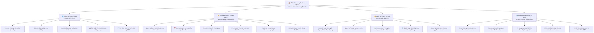
*([🔍 Xem ảnh gốc vector SVG](diagrams/fdd_diagram.svg))*

<details>
<summary><b>Xem mã nguồn Mermaid</b></summary>


```mermaid
graph TD
    HBS["🏨 Hotel Booking System (HBS)<br>Grand Aurora Luxury Hotel"]
    
    CUST["👤 Phân hệ Khách hàng<br>(Customer Portal)"]
    RECEP["🛎️ Phân hệ Lễ tân & Vận hành<br>(Receptionist Operations)"]
    ADMIN["👑 Phân hệ Quản trị viên<br>(Admin & Analytics)"]
    CORE["⚙️ Module Kỹ thuật & Hạ tầng<br>(Cross-cutting & DevOps)"]
    
    HBS --> CUST
    HBS --> RECEP
    HBS --> ADMIN
    HBS --> CORE

    CUST --> C1["Tra cứu phòng trống thời gian thực"]
    CUST --> C2["Giữ chỗ 15p & Đặt cọc VNPay"]
    CUST --> C3["Lịch sử Booking & Tự hủy hoàn cọc"]
    CUST --> C4["🤖 Trợ lý AI Chatbot tư vấn đặt phòng"]
    CUST --> C5["📄 Tải Hóa đơn & Phiếu đặt phòng PDF"]

    RECEP --> R1["Quản lý Danh sách Booking đa tiêu chí"]
    RECEP --> R2["📅 Lịch phòng trực quan Ma trận Timeline"]
    RECEP --> R3["Check-in: Gán N phòng vật lý"]
    RECEP --> R4["Check-out: Thu tiền còn lại & Xuất hóa đơn"]
    RECEP --> R5["Quản lý dọn phòng (Housekeeping)"]
    RECEP --> R6["Đối soát hoàn cọc & Xử lý No-Show"]

    ADMIN --> A1["Quản lý Loại phòng & Upload ảnh Cloudinary"]
    ADMIN --> A2["Quản lý Phòng vật lý & Lịch bảo trì"]
    ADMIN --> A3["📊 Dashboard Thống kê nâng cao & Doanh thu"]
    ADMIN --> A4["🛡️ Audit Log: Nhật ký thao tác hệ thống"]
    ADMIN --> A5["Quản lý tài khoản & phân quyền nhân viên"]

    CORE --> S1["Khóa chống Overbooking (Pessimistic Lock)"]
    CORE --> S2["Hệ thống Email tự động (JavaMailSender)"]
    CORE --> S3["Tự động sao lưu MySQL định kỳ (Cronjob)"]
    CORE --> S4["Giám sát hệ thống (Spring Actuator & Metrics)"]
    CORE --> S5["CI/CD GitHub Actions & Triển khai VPS"]
```
</details>

---

## 3.2. Lược đồ Use Case Chi tiết Theo Vai trò (Use Case Diagrams)

### 3.2.1. Use Case Phân hệ Khách hàng (Customer)

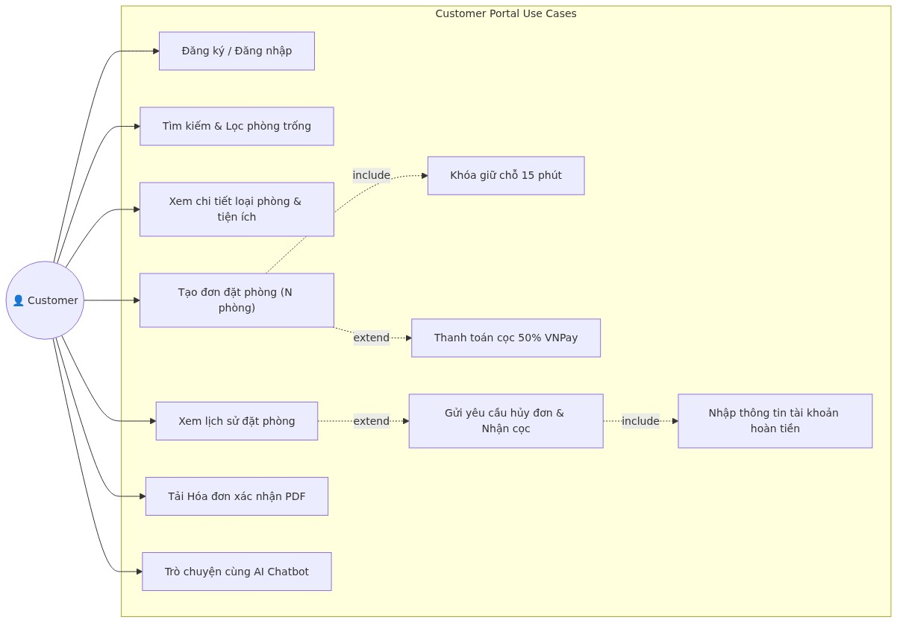
*([🔍 Xem ảnh gốc vector SVG](diagrams/usecase_customer.svg))*

<details>
<summary><b>Xem mã nguồn Mermaid</b></summary>

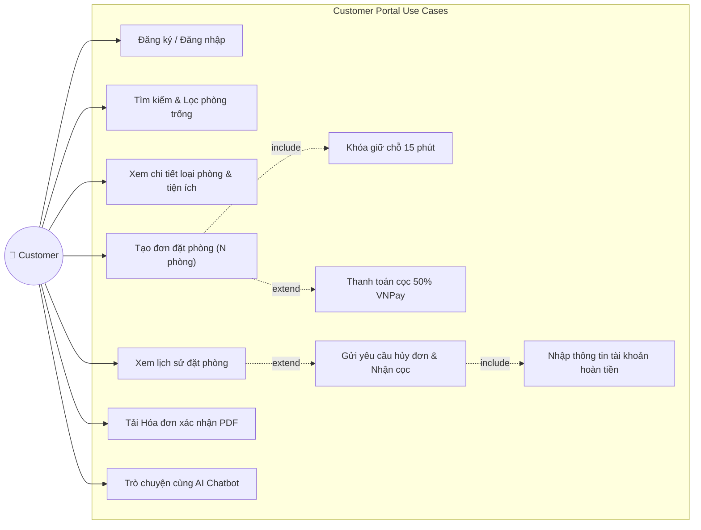
```mermaid
graph LR
    Customer(("👤 Customer"))

    subgraph Customer_Portal["Customer Portal Use Cases"]
        UC_C1["Đăng ký / Đăng nhập"]
        UC_C2["Tìm kiếm & Lọc phòng trống"]
        UC_C3["Xem chi tiết loại phòng & tiện ích"]
        UC_C4["Tạo đơn đặt phòng (N phòng)"]
        UC_C5["Thanh toán cọc 50% VNPay"]
        UC_C6["Xem lịch sử đặt phòng"]
        UC_C7["Gửi yêu cầu hủy đơn & Nhận cọc"]
        UC_C8["Tải Hóa đơn xác nhận PDF"]
        UC_C9["Trò chuyện cùng AI Chatbot"]
        UC_C10["Khóa giữ chỗ 15 phút"]
        UC_C11["Nhập thông tin tài khoản hoàn tiền"]
    end

    Customer --> UC_C1
    Customer --> UC_C2
    Customer --> UC_C3
    Customer --> UC_C4
    Customer --> UC_C6
    Customer --> UC_C8
    Customer --> UC_C9

    UC_C4 -.->|include| UC_C10
    UC_C4 -.->|extend| UC_C5
    UC_C6 -.->|extend| UC_C7
    UC_C7 -.->|include| UC_C11
```
</details>

### 3.2.2. Use Case Phân hệ Lễ tân (Receptionist)

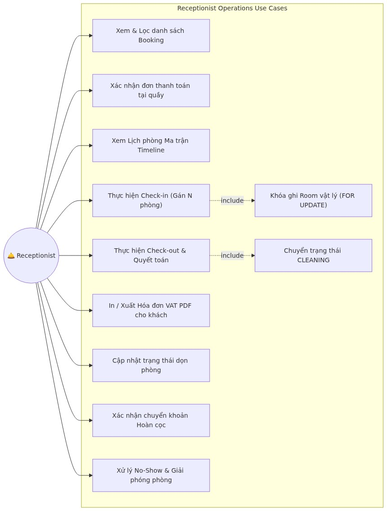
*([🔍 Xem ảnh gốc vector SVG](diagrams/usecase_receptionist.svg))*

<details>
<summary><b>Xem mã nguồn Mermaid</b></summary>

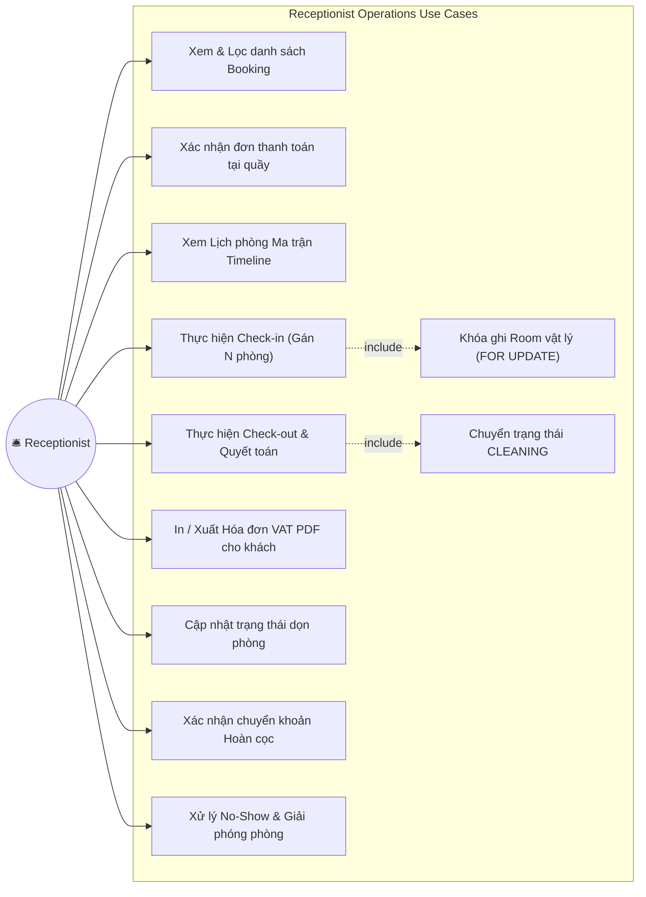
```mermaid
graph LR
    Receptionist(("🛎️ Receptionist"))

    subgraph Recep_Ops["Receptionist Operations Use Cases"]
        UC_R1["Xem & Lọc danh sách Booking"]
        UC_R2["Xác nhận đơn thanh toán tại quầy"]
        UC_R3["Xem Lịch phòng Ma trận Timeline"]
        UC_R4["Thực hiện Check-in (Gán N phòng)"]
        UC_R5["Thực hiện Check-out & Quyết toán"]
        UC_R6["In / Xuất Hóa đơn VAT PDF cho khách"]
        UC_R7["Cập nhật trạng thái dọn phòng"]
        UC_R8["Xác nhận chuyển khoản Hoàn cọc"]
        UC_R9["Xử lý No-Show & Giải phóng phòng"]
        UC_R10["Khóa ghi Room vật lý (FOR UPDATE)"]
        UC_R11["Chuyển trạng thái CLEANING"]
    end

    Receptionist --> UC_R1
    Receptionist --> UC_R2
    Receptionist --> UC_R3
    Receptionist --> UC_R4
    Receptionist --> UC_R5
    Receptionist --> UC_R6
    Receptionist --> UC_R7
    Receptionist --> UC_R8
    Receptionist --> UC_R9

    UC_R4 -.->|include| UC_R10
    UC_R5 -.->|include| UC_R11
```
</details>

### 3.2.3. Use Case Phân hệ Quản trị viên (Admin)

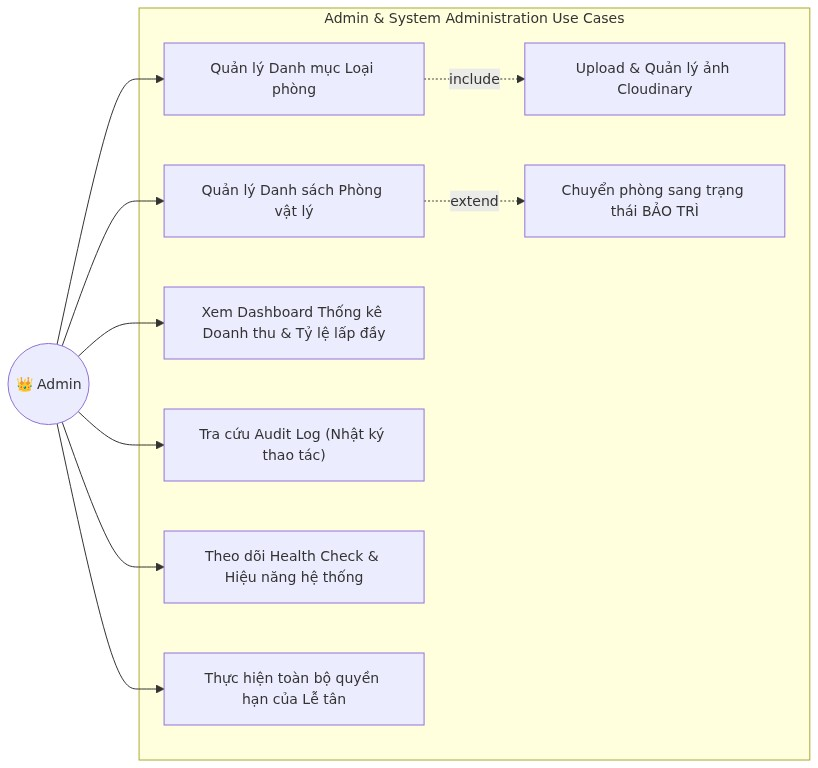
*([🔍 Xem ảnh gốc vector SVG](diagrams/usecase_admin.svg))*

<details>
<summary><b>Xem mã nguồn Mermaid</b></summary>

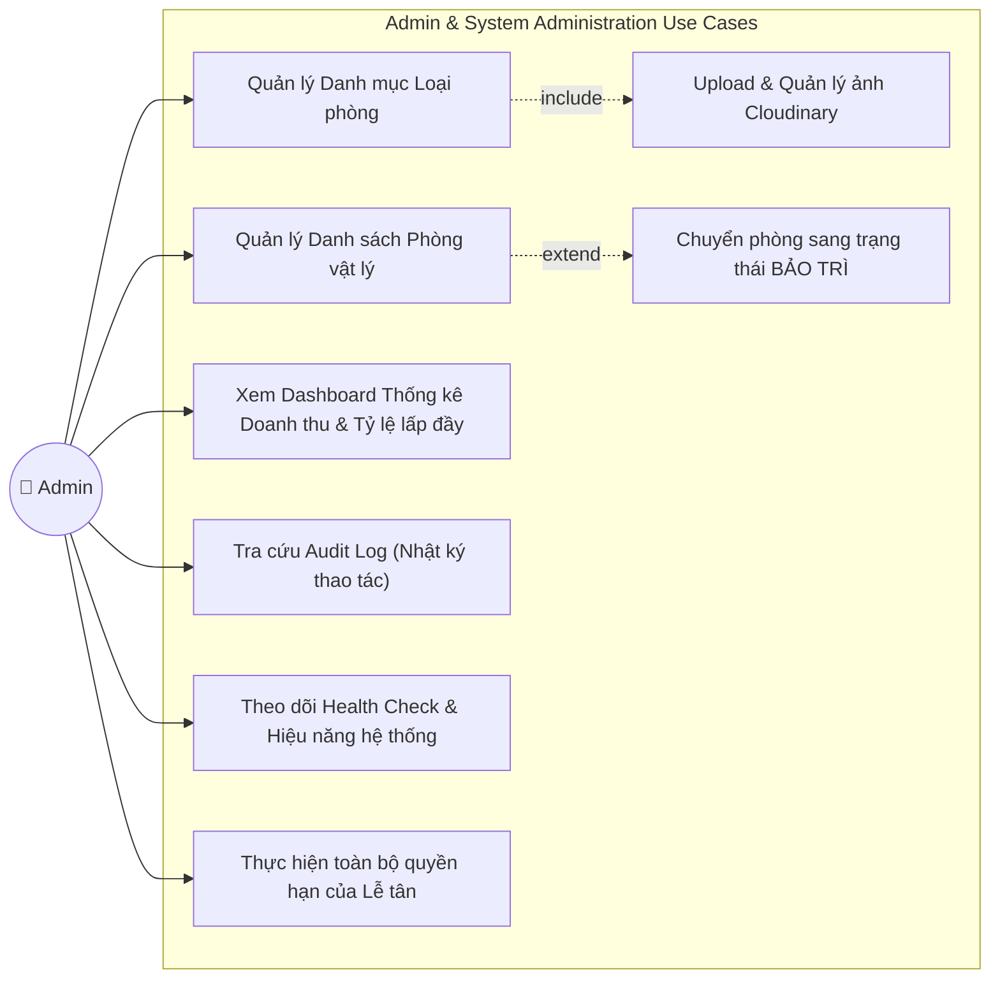
```mermaid
graph LR
    Admin(("👑 Admin"))

    subgraph Admin_UseCases["Admin & System Administration Use Cases"]
        UC_A1["Quản lý Danh mục Loại phòng"]
        UC_A2["Upload & Quản lý ảnh Cloudinary"]
        UC_A3["Quản lý Danh sách Phòng vật lý"]
        UC_A4["Chuyển phòng sang trạng thái BẢO TRÌ"]
        UC_A5["Xem Dashboard Thống kê Doanh thu & Tỷ lệ lấp đầy"]
        UC_A6["Tra cứu Audit Log (Nhật ký thao tác)"]
        UC_A7["Theo dõi Health Check & Hiệu năng hệ thống"]
        UC_A8["Thực hiện toàn bộ quyền hạn của Lễ tân"]
    end

    Admin --> UC_A1
    Admin --> UC_A3
    Admin --> UC_A5
    Admin --> UC_A6
    Admin --> UC_A7
    Admin --> UC_A8

    UC_A1 -.->|include| UC_A2
    UC_A3 -.->|extend| UC_A4
```
</details>

---

## 3.3. Lược đồ Quy trình Nghiệp vụ Cốt lõi (Activity & Process Diagrams)

### 3.3.1. Quy trình Đặt phòng & Khóa giữ chỗ 15 phút chống Overbooking

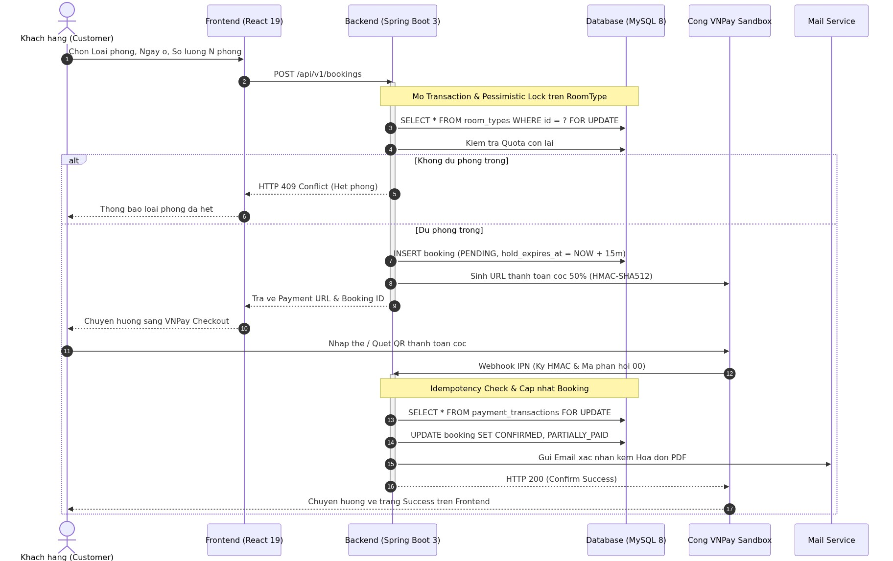
*([🔍 Xem ảnh gốc vector SVG](diagrams/activity_booking_lock.svg))*

<details>
<summary><b>Xem mã nguồn Mermaid</b></summary>

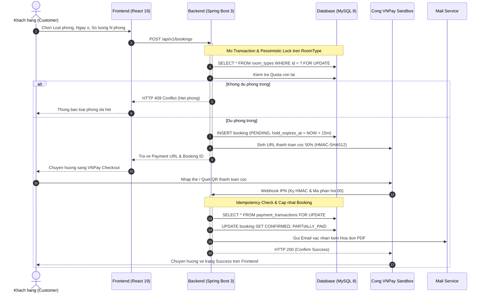
```mermaid
sequenceDiagram
    autonumber
    actor C as Khach hang (Customer)
    participant FE as Frontend (React 19)
    participant BE as Backend (Spring Boot 3)
    participant DB as Database (MySQL 8)
    participant VN as Cong VNPay Sandbox
    participant Mail as Mail Service

    C->>FE: Chon Loai phong, Ngay o, So luong N phong
    FE->>BE: POST /api/v1/bookings
    activate BE
    Note over BE,DB: Mo Transaction & Pessimistic Lock tren RoomType
    BE->>DB: SELECT * FROM room_types WHERE id = ? FOR UPDATE
    BE->>DB: Kiem tra Quota con lai
    alt Khong du phong trong
        BE-->>FE: HTTP 409 Conflict (Het phong)
        FE-->>C: Thong bao loai phong da het
    else Du phong trong
        BE->>DB: INSERT booking (PENDING, hold_expires_at = NOW + 15m)
        BE->>VN: Sinh URL thanh toan coc 50% (HMAC-SHA512)
        BE-->>FE: Tra ve Payment URL & Booking ID
        deactivate BE
        FE-->>C: Chuyen huong sang VNPay Checkout
        C->>VN: Nhap the / Quet QR thanh toan coc
        VN->>BE: Webhook IPN (Ky HMAC & Ma phan hoi 00)
        activate BE
        Note over BE,DB: Idempotency Check & Cap nhat Booking
        BE->>DB: SELECT * FROM payment_transactions FOR UPDATE
        BE->>DB: UPDATE booking SET CONFIRMED, PARTIALLY_PAID
        BE->>Mail: Gui Email xac nhan kem Hoa don PDF
        BE-->>VN: HTTP 200 (Confirm Success)
        deactivate BE
        VN-->>C: Chuyen huong ve trang Success tren Frontend
    end
```
</details>

### 3.3.2. Quy trình Check-in (Gán phòng vật lý) & Check-out (Quyết toán & Hóa đơn)

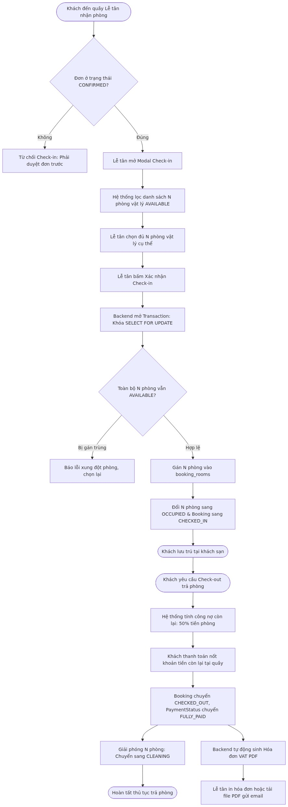
*([🔍 Xem ảnh gốc vector SVG](diagrams/activity_checkin_checkout.svg))*

<details>
<summary><b>Xem mã nguồn Mermaid</b></summary>

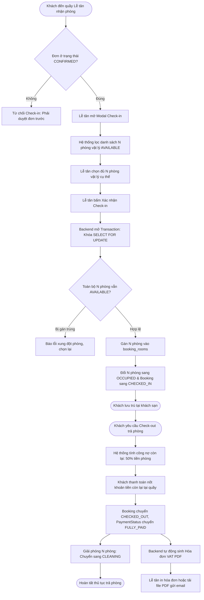
```mermaid
flowchart TD
    StartCheckIn([Khách đến quầy Lễ tân nhận phòng]) --> CheckStatus{Đơn ở trạng thái CONFIRMED?}
    CheckStatus -- Không --> ErrConfirm[Từ chối Check-in: Phải duyệt đơn trước]
    CheckStatus -- Đúng --> OpenModal[Lễ tân mở Modal Check-in]
    OpenModal --> SelectRooms[Hệ thống lọc danh sách N phòng vật lý AVAILABLE]
    SelectRooms --> ChooseRooms[Lễ tân chọn đủ N phòng vật lý cụ thể]
    ChooseRooms --> ConfirmCheckIn[Lễ tân bấm Xác nhận Check-in]
    
    ConfirmCheckIn --> LockRooms[Backend mở Transaction: Khóa SELECT FOR UPDATE]
    LockRooms --> VerifyAvail{Toàn bộ N phòng vẫn AVAILABLE?}
    VerifyAvail -- Bị gán trùng --> ErrAssign[Báo lỗi xung đột phòng, chọn lại]
    VerifyAvail -- Hợp lệ --> AssignSuccess[Gán N phòng vào booking_rooms]
    AssignSuccess --> UpdateStatus[Đổi N phòng sang OCCUPIED & Booking sang CHECKED_IN]
    UpdateStatus --> InStay([Khách lưu trú tại khách sạn])

    InStay --> StartCheckOut([Khách yêu cầu Check-out trả phòng])
    StartCheckOut --> CalcDue[Hệ thống tính công nợ còn lại: 50% tiền phòng]
    CalcDue --> PayDue[Khách thanh toán nốt khoản tiền còn lại tại quầy]
    PayDue --> FinalizeBooking[Booking chuyển CHECKED_OUT, PaymentStatus chuyển FULLY_PAID]
    FinalizeBooking --> ReleaseRooms[Giải phóng N phòng: Chuyển sang CLEANING]
    FinalizeBooking --> GenPDF[Backend tự động sinh Hóa đơn VAT PDF]
    GenPDF --> PrintSend[Lễ tân in hóa đơn hoặc tải file PDF gửi email]
    ReleaseRooms --> EndFlow([Hoàn tất thủ tục trả phòng])
```
</details>

### 3.3.3. Quy trình Tự hủy phòng & Thuật toán Phạt cọc 4 bậc mốc 14:00

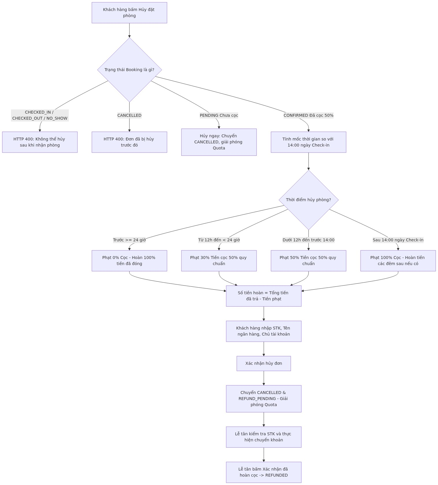
*([🔍 Xem ảnh gốc vector SVG](diagrams/activity_cancellation_refund.svg))*

<details>
<summary><b>Xem mã nguồn Mermaid</b></summary>

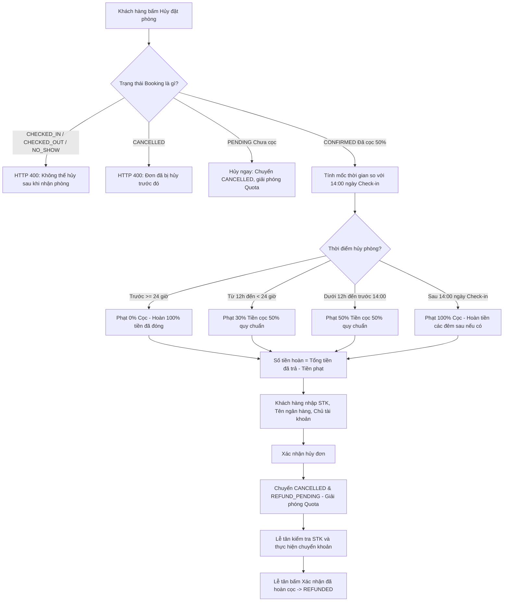
```mermaid
flowchart TD
    A[Khách hàng bấm Hủy đặt phòng] --> B{Trạng thái Booking là gì?}
    B -- CHECKED_IN / CHECKED_OUT / NO_SHOW --> C[HTTP 400: Không thể hủy sau khi nhận phòng]
    B -- CANCELLED --> D[HTTP 400: Đơn đã bị hủy trước đó]
    B -- PENDING Chưa cọc --> E[Hủy ngay: Chuyển CANCELLED, giải phóng Quota]
    
    B -- CONFIRMED Đã cọc 50% --> F[Tính mốc thời gian so với 14:00 ngày Check-in]
    F --> G{Thời điểm hủy phòng?}
    
    G -- Trước >= 24 giờ --> H1[Phạt 0% Cọc - Hoàn 100% tiền đã đóng]
    G -- Từ 12h đến < 24 giờ --> H2[Phạt 30% Tiền cọc 50% quy chuẩn]
    G -- Dưới 12h đến trước 14:00 --> H3[Phạt 50% Tiền cọc 50% quy chuẩn]
    G -- Sau 14:00 ngày Check-in --> H4[Phạt 100% Cọc - Hoàn tiền các đêm sau nếu có]
    
    H1 --> Calc[Số tiền hoàn = Tổng tiền đã trả - Tiền phạt]
    H2 --> Calc
    H3 --> Calc
    H4 --> Calc

    Calc --> PromptBank[Khách hàng nhập STK, Tên ngân hàng, Chủ tài khoản]
    PromptBank --> SubmitCancel[Xác nhận hủy đơn]
    SubmitCancel --> UpdateRefund[Chuyển CANCELLED & REFUND_PENDING - Giải phóng Quota]
    UpdateRefund --> RecepAction[Lễ tân kiểm tra STK và thực hiện chuyển khoản]
    RecepAction --> ConfirmRefund[Lễ tân bấm Xác nhận đã hoàn cọc -> REFUNDED]
```
</details>

### 3.3.4. Quy trình Tự động hóa bằng Cronjob (Quét hết hạn & Xử lý No-Show)

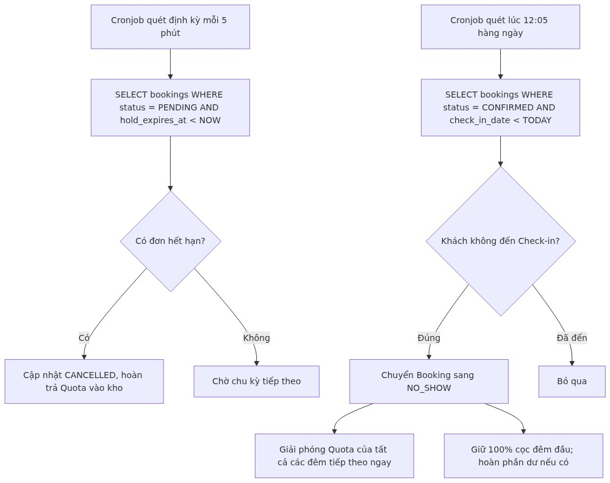
*([🔍 Xem ảnh gốc vector SVG](diagrams/activity_cronjob_noshow.svg))*

<details>
<summary><b>Xem mã nguồn Mermaid</b></summary>

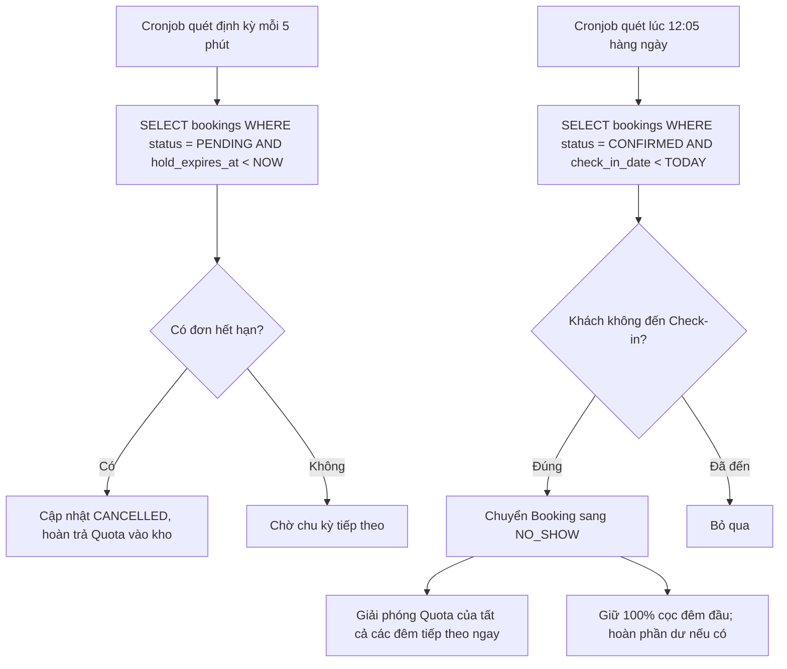
```mermaid
flowchart TD
    Cron1[Cronjob quét định kỳ mỗi 5 phút] --> Q1[SELECT bookings WHERE status = PENDING AND hold_expires_at < NOW]
    Q1 --> Loop1{Có đơn hết hạn?}
    Loop1 -- Có --> Expire[Cập nhật CANCELLED, hoàn trả Quota vào kho]
    Loop1 -- Không --> Sleep1[Chờ chu kỳ tiếp theo]

    Cron2[Cronjob quét lúc 12:05 hàng ngày] --> Q2[SELECT bookings WHERE status = CONFIRMED AND check_in_date < TODAY]
    Q2 --> CheckNoShow{Khách không đến Check-in?}
    CheckNoShow -- Đúng --> ActNoShow[Chuyển Booking sang NO_SHOW]
    ActNoShow --> ReleaseFutureNights[Giải phóng Quota của tất cả các đêm tiếp theo ngay]
    ActNoShow --> FineNoShow[Giữ 100% cọc đêm đầu; hoàn phần dư nếu có]
    CheckNoShow -- Đã đến --> Skip[Bỏ qua]
```
</details>

---

## 3.4. Lược đồ Máy Trạng thái Vòng đời (State Machine Diagrams)

### 3.4.1. Vòng đời Trạng thái Đặt phòng (Booking Lifecycle)

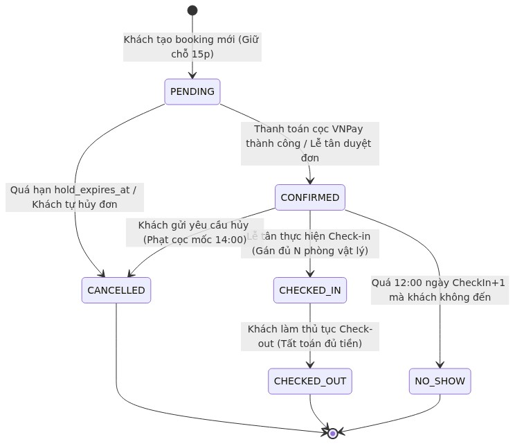
*([🔍 Xem ảnh gốc vector SVG](diagrams/state_booking_lifecycle.svg))*

<details>
<summary><b>Xem mã nguồn Mermaid</b></summary>

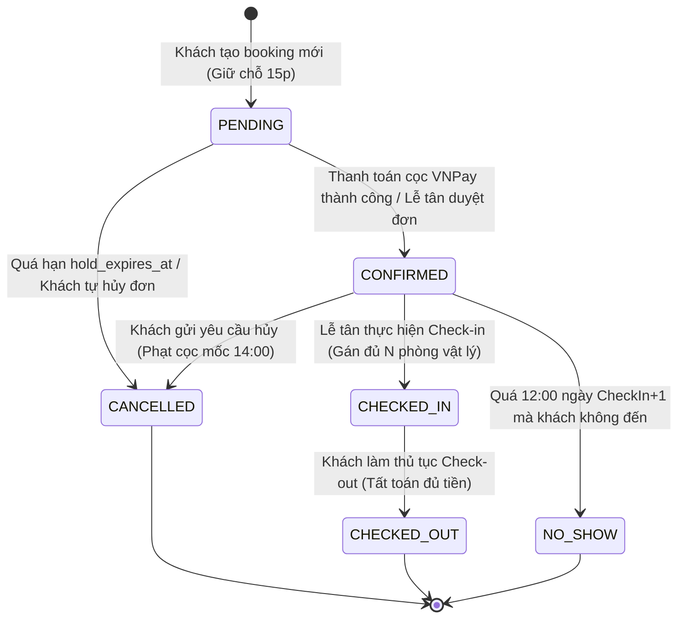
```mermaid
stateDiagram-v2
    [*] --> PENDING: Khách tạo booking mới (Giữ chỗ 15p)
    
    PENDING --> CONFIRMED: Thanh toán cọc VNPay thành công / Lễ tân duyệt đơn
    PENDING --> CANCELLED: Quá hạn hold_expires_at / Khách tự hủy đơn
    
    CONFIRMED --> CHECKED_IN: Lễ tân thực hiện Check-in (Gán đủ N phòng vật lý)
    CONFIRMED --> CANCELLED: Khách gửi yêu cầu hủy (Phạt cọc mốc 14:00)
    CONFIRMED --> NO_SHOW: Quá 12:00 ngày CheckIn+1 mà khách không đến
    
    CHECKED_IN --> CHECKED_OUT: Khách làm thủ tục Check-out (Tất toán đủ tiền)
    
    CANCELLED --> [*]
    CHECKED_OUT --> [*]
    NO_SHOW --> [*]
```
</details>

### 3.4.2. Vòng đời Trạng thái Phòng vật lý (Physical Room Lifecycle)

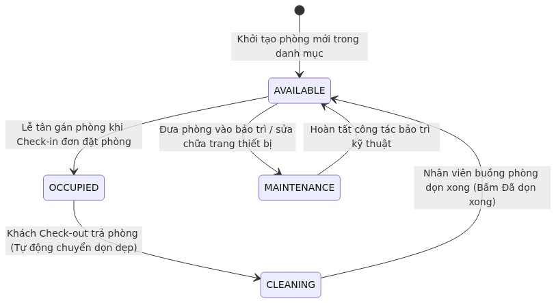
*([🔍 Xem ảnh gốc vector SVG](diagrams/state_room_lifecycle.svg))*

<details>
<summary><b>Xem mã nguồn Mermaid</b></summary>

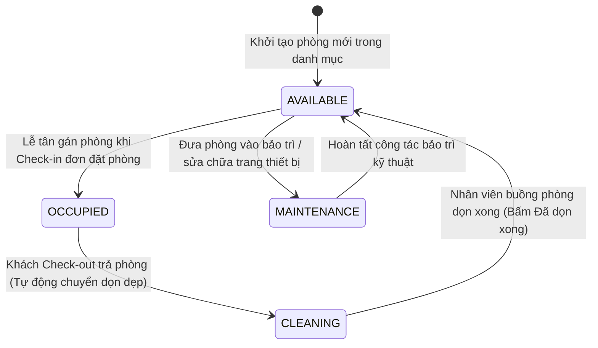
```mermaid
stateDiagram-v2
    [*] --> AVAILABLE: Khởi tạo phòng mới trong danh mục
    
    AVAILABLE --> OCCUPIED: Lễ tân gán phòng khi Check-in đơn đặt phòng
    AVAILABLE --> MAINTENANCE: Đưa phòng vào bảo trì / sửa chữa trang thiết bị
    
    OCCUPIED --> CLEANING: Khách Check-out trả phòng (Tự động chuyển dọn dẹp)
    
    CLEANING --> AVAILABLE: Nhân viên buồng phòng dọn xong (Bấm Đã dọn xong)
    
    MAINTENANCE --> AVAILABLE: Hoàn tất công tác bảo trì kỹ thuật
```
</details>


---

# 4. Kiến trúc & Thiết kế hệ thống (Architecture & Design)

## 4.1. Kiến trúc Modular Monolith & Phân lớp (Layered Architecture)

Hệ thống tuân thủ kiến trúc phân lớp rõ ràng bên trong một khối Monolith duy nhất:


```text
backend/src/main/java/com/hotel/
├── auth/                 # Controller, Service, JwtProvider, UserDetailsServiceImpl
├── user/                 # UserController, UserService, UserRepository, Entity User, Role
├── room/                 # RoomTypeController, RoomController, RoomService, Entity RoomType, Room
├── booking/              # BookingController, BookingService, Entity Booking, BookingRoom
├── payment/              # PaymentController, VnPayService, Entity PaymentTransaction
├── dashboard/            # DashboardController, DashboardService
└── common/
    ├── config/           # SecurityConfig, CorsConfig, CloudinaryConfig, VnPayConfig
    ├── exception/        # Custom Exceptions, GlobalExceptionHandler
    ├── response/         # ApiResponse<T>, PageResponse<T>
    └── schedule/         # AutoCancelScheduleJob (Cronjob 15m & 18:00)
```

## 3.2. Mô hình Thực thể & Trạng thái Hệ thống

### 1. Trạng thái Phòng vật lý (`RoomStatus`)
`AVAILABLE` (Trống sẵn sàng) $\rightleftharpoons$ `OCCUPIED` (Đang có khách) $\rightarrow$ `CLEANING` (Đang dọn dẹp) $\rightarrow$ `AVAILABLE`.  
*(Phòng có thể chuyển sang `MAINTENANCE` từ bất kỳ trạng thái trống nào khi cần sửa chữa).*

### 2. Trạng thái Đặt phòng (`BookingStatus`)
- `PENDING`: Đơn mới tạo (chờ cọc VNPay trong 15 phút hoặc chờ Lễ tân xác nhận).
- `CONFIRMED`: Đơn đã được xác nhận (đã cọc hoặc lễ tân duyệt). **Chỉ đơn CONFIRMED mới được Check-in.**
- `CHECKED_IN`: Khách đã nhận phòng (đã gán đủ $N$ phòng vật lý).
- `CHECKED_OUT`: Khách đã trả phòng và đối soát hoàn tất.
- `CANCELLED`: Đơn đã bị hủy (khách tự hủy, hết hạn 15 phút, hoặc tự hủy 18:00).
- `NO_SHOW`: Khách đã cọc nhưng không đến nhận phòng suốt kỳ lưu trú.

### 3. Trạng thái Thanh toán tổng thể (`PaymentStatus`)
- `UNPAID`: Chưa thanh toán đồng nào.
- `PARTIALLY_PAID`: Đã thanh toán tiền cọc (50%).
- `FULLY_PAID`: Đã tất toán đủ 100% tổng tiền phòng.
- `REFUND_PENDING`: Đang chờ lễ tân chuyển khoản hoàn cọc.
- `REFUNDED`: Đã hoàn tất chuyển khoản trả cọc cho khách.

### 4. Trạng thái Giao dịch Thanh toán (`PaymentTransactionStatus`)
- `PENDING`: Giao dịch đang chờ khách thanh toán trên cổng VNPay.
- `SUCCESS`: Khách thanh toán thành công (xác thực chữ ký hợp lệ).
- `FAILED`: Giao dịch bị lỗi, hủy bỏ hoặc ngân hàng từ chối.
- `EXPIRED`: Giao dịch quá thời hạn 15 phút mà không hoàn tất.

### Sơ đồ Lớp Thực thể Dữ liệu (ERD Core Entities)

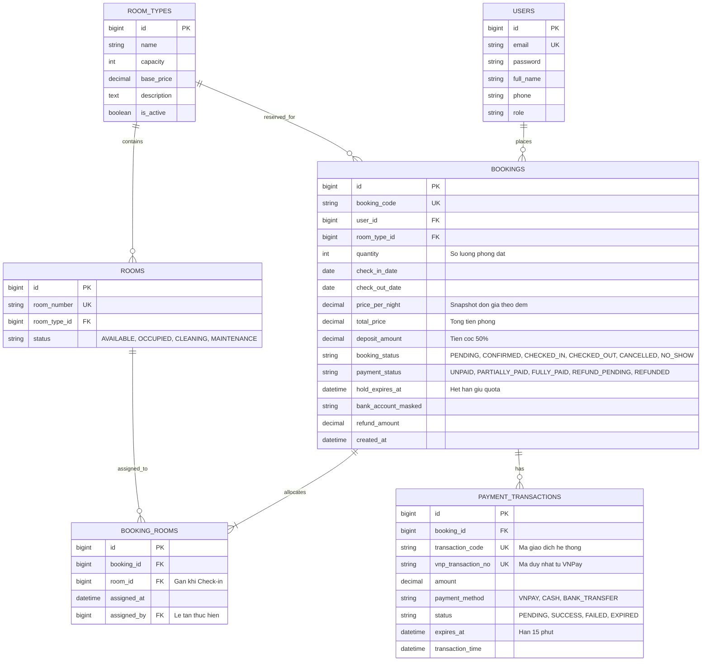
```mermaid
erDiagram
    USERS ||--o{ BOOKINGS : "places"
    ROOM_TYPES ||--o{ ROOMS : "contains"
    ROOM_TYPES ||--o{ BOOKINGS : "reserved_for"
    BOOKINGS ||--|{ BOOKING_ROOMS : "allocates"
    ROOMS ||--o{ BOOKING_ROOMS : "assigned_to"
    BOOKINGS ||--o{ PAYMENT_TRANSACTIONS : "has"

    USERS {
        bigint id PK
        string email UK
        string password
        string full_name
        string phone
        string role
    }

    ROOM_TYPES {
        bigint id PK
        string name
        int capacity
        decimal base_price
        text description
        boolean is_active
    }

    ROOMS {
        bigint id PK
        string room_number UK
        bigint room_type_id FK
        string status "AVAILABLE, OCCUPIED, CLEANING, MAINTENANCE"
    }

    BOOKINGS {
        bigint id PK
        string booking_code UK
        bigint user_id FK
        bigint room_type_id FK
        int quantity "So luong phong dat"
        date check_in_date
        date check_out_date
        decimal price_per_night "Snapshot don gia theo dem"
        decimal total_price "Tong tien phong"
        decimal deposit_amount "Tien coc 50%"
        string booking_status "PENDING, CONFIRMED, CHECKED_IN, CHECKED_OUT, CANCELLED, NO_SHOW"
        string payment_status "UNPAID, PARTIALLY_PAID, FULLY_PAID, REFUND_PENDING, REFUNDED"
        datetime hold_expires_at "Het han giu quota"
        string bank_account_masked
        decimal refund_amount
        datetime created_at
    }

    BOOKING_ROOMS {
        bigint id PK
        bigint booking_id FK
        bigint room_id FK "Gan khi Check-in"
        datetime assigned_at
        bigint assigned_by FK "Le tan thuc hien"
    }

    PAYMENT_TRANSACTIONS {
        bigint id PK
        bigint booking_id FK
        string transaction_code UK "Ma giao dich he thong"
        string vnp_transaction_no UK "Ma duy nhat tu VNPay"
        decimal amount
        string payment_method "VNPAY, CASH, BANK_TRANSFER"
        string status "PENDING, SUCCESS, FAILED, EXPIRED"
        datetime expires_at "Han 15 phut"
        datetime transaction_time
    }
```

## 3.3. Thuật toán Kiểm tra Khả dụng & Chống Overbooking (Pessimistic Lock)

### Nguyên tắc tính Quota theo Loại phòng
Tại một thời điểm, số lượng phòng trống của một Loại phòng trong khoảng $[CheckIn, CheckOut)$ được xác định:
$$AvailableRooms = TotalActiveRooms - BookedRoomsCount$$
Trong đó:
- $TotalActiveRooms$: Đếm tổng số phòng vật lý thuộc loại phòng đó có `status != 'MAINTENANCE'` (các phòng đang có trạng thái hiện tại là `AVAILABLE`, `OCCUPIED`, `CLEANING` đều là tài nguyên buồng phòng active để phục vụ cho các lượt đặt trong tương lai; chỉ những phòng bảo trì dài hạn `MAINTENANCE` mới bị loại trừ khỏi tổng năng lực phục vụ).
- $BookedRoomsCount$: Tổng $\sum quantity$ của các Booking cùng loại phòng có khoảng thời gian giao nhau với $[CheckIn, CheckOut)$ theo điều kiện $A_{in} < B_{out} \text{ and } A_{out} > B_{in}$, đồng thời thỏa mãn một trong các điều kiện chiếm giữ quota hợp lệ:
  1. **Booking `CONFIRMED` hoặc `CHECKED_IN`:** Luôn giữ quota cho toàn bộ khoảng thời gian lưu trú $[CheckIn, CheckOut)$.
  2. **Booking `PENDING` (chờ cọc VNPay hoặc chờ Lễ tân xác nhận) CÒN TRONG HẠN GIỮ CHỖ ($T_{now} \le hold\_expires\_at$):** Bắt đầu giữ quota ngay từ thời điểm tạo đơn cho toàn bộ khoảng lưu trú $[CheckIn, CheckOut)$ (kể cả đơn cho tuần sau hay tháng sau):
     - Với Booking cọc VNPay: $hold\_expires\_at = created\_at + 15\text{ phút}$.
     - Với Booking thanh toán tại khách sạn đặt trước $\ge 24\text{ giờ}$ so với ngày nhận phòng: $hold\_expires\_at = created\_at + 24\text{ giờ}$ (thời hạn để Lễ tân liên hệ khách xác nhận đơn).
     - Với Booking thanh toán tại khách sạn đặt trong vòng $24\text{ giờ}$ hoặc trong ngày: $hold\_expires\_at = \min(created\_at + 2\text{ giờ}, \text{check\_in\_date } 18:00)$.
  3. **Giải phóng Quota:** Khi $T_{now} > hold\_expires\_at$ mà chưa hoàn tất xác nhận (VNPay chưa thanh toán hoặc Lễ tân chưa bấm xác nhận) $\to$ Cronjob tự động chuyển Booking sang `CANCELLED` (Lý do: `PAYMENT_EXPIRED` hoặc `UNCONFIRMED_TIMEOUT`), ngay lập tức loại khỏi $BookedRoomsCount$ để giải phóng quota phòng.
  4. **Loại trừ tuyệt đối:** Các Booking có trạng thái `CANCELLED`, `CHECKED_OUT`, hoặc `NO_SHOW` không bao giờ được tính vào $BookedRoomsCount$. (Đặc biệt với đơn nhiều đêm bị `NO_SHOW`: ngay tại mốc 12:00 ngày $CheckIn + 1$, khi chuyển sang `NO_SHOW`, toàn bộ quota của các đêm còn lại từ ngày $CheckIn + 1$ đến $CheckOut$ được giải phóng ngay lập tức để mở bán lại).

### Cơ chế Bảo vệ Đồng thời (Concurrency Control)
Để tránh hoàn toàn lỗi Race Condition giữa việc Khách đặt phòng online và Lễ tân gán phòng tại quầy, hệ thống áp dụng cơ chế khóa hai tầng:

1. **Khi Tạo Đặt phòng (Lock Quota Logic):**
   - Mở `@Transactional(isolation = Isolation.READ_COMMITTED)`.
   - Khóa ghi bản ghi Loại phòng: `SELECT * FROM room_types WHERE id = ? FOR UPDATE`.
   - Tính toán $AvailableRooms$ theo công thức trên.
   - Nếu $AvailableRooms \ge RequestedQuantity$:
     - Tạo bản ghi `Booking` với trạng thái `PENDING` và gán đúng giá trị `hold_expires_at`.
     - Sinh $N$ bản ghi dự kiến trong `booking_rooms` với đơn giá snapshot (`room_id` để `NULL`, sẽ gán khi Check-in).
     - Nếu chọn VNPay: Tạo `PaymentTransaction` trạng thái `PENDING` (thời hạn 15 phút) $\to$ Sinh URL VNPay.
     - Commit Transaction.
   - Nếu $AvailableRooms < RequestedQuantity$:
     - Rollback Transaction $\to$ Ném ngoại lệ `RoomNotAvailableException` ("Số lượng phòng trống không đủ").

2. **Khi Check-in (Lock Phòng Vật lý Cụ thể):**
   - Khi Lễ tân chọn danh sách $N$ phòng vật lý cụ thể (ví dụ: Phòng 101, 102), backend mở Transaction và thực hiện khóa trực tiếp các dòng phòng vật lý đó:
     ```sql
     SELECT * FROM rooms WHERE id IN (:roomIds) FOR UPDATE;
     ```
   - Kiểm tra nghiêm ngặt: Toàn bộ $N$ phòng này phải đang có `status = 'AVAILABLE'`.
   - Nếu có bất kỳ phòng nào đã bị Lễ tân ở quầy khác chọn gán trước đó trong cùng 1 thời điểm $\to$ Rollback Transaction và ném lỗi `RoomAlreadyAssignedException` yêu cầu chọn lại phòng khác, đảm bảo hai giao dịch không bao giờ cùng gán chung một phòng vật lý.
   - Nếu hợp lệ: Cập nhật $N$ phòng sang `OCCUPIED`, gán `room_id` vào `booking_rooms`, chuyển Booking sang `CHECKED_IN` $\to$ Commit Transaction.

---

# 4. Yêu cầu kỹ thuật chi tiết (Technical Requirements)

## 4.1. Chi tiết Tech Stack

| Tầng              | Công nghệ lựa chọn            | Phiên bản           | Mục đích & Ràng buộc kỹ thuật                                    |
|-------------------|-------------------------------|---------------------|------------------------------------------------------------------|
| **Backend**       | Spring Boot                   | 3.3.x (3.3.5)       | Framework Java chuẩn doanh nghiệp, kiến trúc phân lớp sạch       |
| **Ngôn ngữ**      | Java                          | 21 LTS              | Records, Virtual Threads, Pattern Matching, Temurin-21 Base      |
| **Frontend**      | ReactJS + Vite                | React 18/19, Vite 5 | SPA tối ưu, tốc độ build nhanh, HMR tức thì                      |
| **Styling**       | Tailwind CSS / CSS Modules    | 3.4.x / Vanilla     | Responsive trên mọi kích thước màn hình                          |
| **ORM**           | Spring Data JPA (Hibernate 6) | Mới nhất            | Transaction management, `@Lock(LockModeType.PESSIMISTIC_WRITE)`  |
| **Database**      | MySQL                         | 8.0                 | Lưu trữ ACID, Row-level Locking với InnoDB Engine                |
| **Database Migration** | Flyway                   | 10.x                | Quản lý phiên bản schema độc lập (`V1__init`, `V2__seed`)       |
| **Bảo mật**       | Spring Security + JJWT        | 0.12.x              | Stateless JWT, BCryptPasswordEncoder (strength 10)               |
| **Thanh toán**    | VNPay Sandbox API             | v2.1.0              | HMAC-SHA512 checksum, IPN Webhook với kiểm tra Idempotency       |
| **Media Cloud**   | Cloudinary Java SDK           | 1.36.x              | Quản lý và nén ảnh buồng phòng tự động                           |
| **Container**     | Docker & Docker Compose       | Engine 24+, Compose v2 | Môi trường container đồng nhất, networking nội bộ an toàn     |
| **CI / CD**       | GitHub Actions                | v4                  | Pipeline tự động: Build, Unit Test, SSH Deploy VPS               |
| **Reverse Proxy** | Nginx                         | Alpine Mới nhất     | Serve React static, SSL Termination, Proxy pass tới Backend 8080 |

## 4.2. Bảo mật Giao dịch VNPay (Security & Idempotency)
1. **Kiểm tra chữ ký (Checksum Verification):** Mọi request trả về từ VNPay (Return URL và IPN URL) đều bắt buộc băm toàn bộ tham số với `VNPAY_HASH_SECRET` bằng thuật toán HMAC-SHA512. Nếu chữ ký không khớp $\to$ Từ chối xử lý ngay lập tức (mã phản hồi `97`).
2. **Kiểm tra số tiền (Amount Matching):** So sánh `vnp_Amount / 100` với chính xác số tiền cọc đã ghi nhận trên hệ thống. Nếu sai lệch $\to$ Từ chối (mã phản hồi `04`).
3. **Chống xử lý lặp (Idempotent Handling):** VNPay có thể gửi IPN nhiều lần cho cùng 1 giao dịch. Backend kiểm tra trạng thái giao dịch trong DB: nếu đã là `SUCCESS` hoặc `FAILED` thì trả về kết quả thành công ngay mà không thực hiện cộng tiền hay đổi trạng thái lần 2 (mã phản hồi `02`).

---

# 5. Yêu cầu chức năng chi tiết (Functional Requirements)

## 5.1. Phân hệ Khách hàng (Customer)

### FR-01: Đăng ký, Đăng nhập & Token Lifecycle
- **FR-01.1:** Khách hàng đăng ký bằng Email (duy nhất), Mật khẩu (tối thiểu 6 ký tự), Họ tên, Số điện thoại. Mật khẩu mã hóa BCrypt.
- **FR-01.2:** Đăng nhập thành công trả về Access Token (15–30 phút) và Refresh Token (7 ngày, lưu `HttpOnly Cookie`).
- **FR-01.3:** Tự động gọi endpoint refresh token khi access token hết hạn; tự động đăng xuất nếu refresh token hết hạn.

### FR-02: Tra cứu Loại phòng & Kiểm tra phòng trống
- **FR-02.1:** Khách chọn ngày Check-in, ngày Check-out (bắt buộc `Check-out > Check-in`) và số khách.
- **FR-02.2:** Hệ thống trả về danh sách Loại phòng còn phòng trống, số lượng phòng còn lại khả dụng và giá/đêm.
- **FR-02.3:** Xem trang chi tiết Loại phòng: Hình ảnh Cloudinary, tiện nghi, mô tả, chính sách cọc và hủy phòng.

### FR-03: Đặt phòng & Thanh toán Cọc VNPay
- **FR-03.1:** Khách hàng chọn Loại phòng, ngày lưu trú và **số lượng phòng cần đặt ($N \ge 1$)**.
- **FR-03.2:** Khách chọn phương thức thanh toán:
  - *Phương thức A (Cọc VNPay):* Bắt buộc cọc đúng **50% tổng tiền phòng**. Hệ thống giữ quota trong 15 phút (`hold_expires_at = created_at + 15m`) và chuyển hướng đến trang thanh toán VNPay. Khách thanh toán thành công $\to$ Giao dịch `SUCCESS`, Booking tự động chuyển `CONFIRMED`, `PaymentStatus` chuyển `PARTIALLY_PAID`.
  - *Phương thức B (Thanh toán tại khách sạn):* Booking tạo ở trạng thái `PENDING`, `PaymentStatus` là `UNPAID`. Hệ thống tự động gán thời hạn giữ chỗ `hold_expires_at`: giữ 24 giờ cho đơn đặt trước $\ge 24h$ để Lễ tân liên hệ xác minh, hoặc giữ đến 18:00 ngày Check-in cho đơn đặt trong ngày. Đơn giữ quota cho toàn bộ khoảng lưu trú $[CheckIn, CheckOut)$ trong thời gian còn hạn. Lễ tân bấm "Xác nhận" $\to$ chuyển `CONFIRMED`. Quá hạn mà chưa duyệt $\to$ Cronjob tự động hủy (`UNCONFIRMED_TIMEOUT`), giải phóng quota.

### FR-04: Lịch sử Đặt phòng & Tự Hủy phòng Hoàn cọc
- **FR-04.1:** Xem danh sách booking cá nhân theo từng tab trạng thái (`PENDING`, `CONFIRMED`, `CHECKED_IN`, `CHECKED_OUT`, `CANCELLED`).
- **FR-04.2:** Khách hàng gửi yêu cầu hủy đơn:
  - Đơn chưa cọc: Hủy ngay lập tức $\to$ Booking chuyển `CANCELLED`, giải phóng quota phòng.
  - Đơn đã cọc hoặc đã thanh toán đủ: Hệ thống tính số tiền phạt dựa trên mức cọc quy chuẩn 50% theo mốc **14:00 ngày Check-in** (0%, 30%, 50%, 100%). Số tiền hoàn = Tổng tiền đã trả - Tiền phạt (phần thanh toán vượt cọc luôn được hoàn 100%).
  - Nếu số tiền hoàn lại $> 0$: Khách hàng nhập thông tin tài khoản nhận hoàn (Ngân hàng, Số tài khoản, Tên thụ hưởng). Sau khi xác nhận $\to$ Booking chuyển `CANCELLED`, `PaymentStatus` chuyển `REFUND_PENDING`.
  - **Ràng buộc:** Chặn tuyệt đối việc hủy đơn nếu booking đang có trạng thái `CHECKED_IN`, `CHECKED_OUT`, hoặc `NO_SHOW` (báo lỗi HTTP `400 Bad Request`).

## 5.2. Phân hệ Lễ tân & Vận hành (Receptionist)

### FR-05: Quản lý Danh sách Booking (Table View)
- **FR-05.1:** Giao diện dạng Bảng với đầy đủ bộ lọc: Khoảng ngày, Trạng thái Booking, Trạng thái Thanh toán, tìm kiếm Mã booking / Tên / SĐT.
- **FR-05.2:** Thao tác duyệt đơn: Lễ tân bấm "Xác nhận" đối với đơn `PENDING` thanh toán tại quầy $\to$ Booking chuyển sang `CONFIRMED`.

### FR-06: Nghiệp vụ Check-in (Gán $N$ phòng vật lý)
- **FR-06.1:** Điều kiện tiên quyết: Booking bắt buộc phải ở trạng thái **`CONFIRMED`**.
- **FR-06.2:** Khi khách đến nhận phòng, Lễ tân bấm "Check-in". Modal hiển thị danh sách các phòng vật lý đang `AVAILABLE` thuộc Loại phòng đã đặt.
- **FR-06.3:** Lễ tân tích chọn đủ $N$ phòng cụ thể và bấm "Xác nhận Check-in". Backend mở transaction và khóa ghi các phòng vật lý (`FOR UPDATE`), xác thực toàn bộ $N$ phòng này vẫn đang ở trạng thái `AVAILABLE` trước khi gán vào `booking_rooms`, chuyển Booking sang `CHECKED_IN` và đổi trạng thái $N$ phòng sang `OCCUPIED`. Nếu có phòng bị gán trùng tại quầy khác trong cùng một thời điểm, hệ thống báo lỗi ngay để chọn phòng khác.

### FR-07: Nghiệp vụ Check-out & Đối soát Tất toán
- **FR-07.1:** Khách trả phòng $\to$ Lễ tân bấm "Check-out".
- **FR-07.2:** Modal tính toán công nợ: $\text{Số tiền còn lại} = \text{Tổng tiền phòng} - \text{Tiền đã thanh toán}$.
- **FR-07.3:** Lễ tân ghi nhận thu tiền mặt/quẹt thẻ $\to$ `PaymentStatus` chuyển `FULLY_PAID`, Booking chuyển `CHECKED_OUT`.
- **FR-07.4:** Toàn bộ $N$ phòng vật lý tự động chuyển trạng thái sang **`CLEANING`**.

### FR-08: Nghiệp vụ Dọn phòng (Housekeeping)
- **FR-08.1:** Màn hình danh sách phòng lọc theo trạng thái `CLEANING`.
- **FR-08.2:** Sau khi phòng được vệ sinh sạch sẽ, nhân viên bấm "Đã dọn xong" $\to$ Phòng chuyển sang `AVAILABLE` sẵn sàng đón khách mới.

### FR-09: Quản lý Hoàn tiền Cọc (Refund Management)
- **FR-09.1:** Tab hiển thị danh sách các đơn `REFUND_PENDING` kèm số tiền cần hoàn và số tài khoản ngân hàng (được che bảo mật dạng `**** **** 7890`).
- **FR-09.2:** Sau khi chuyển khoản cho khách ngoài đời thực, Lễ tân/Admin bấm "Xác nhận đã hoàn" kèm mã giao dịch ngân hàng $\to$ `PaymentStatus` chuyển sang `REFUNDED`.

### FR-10: Xử lý Khách không đến (No-Show) với Booking Nhiều Đêm
- **FR-10.1:** Với đơn đã cọc hoặc đã thanh toán trước mà khách không đến nhận phòng trước 12:00 trưa ngày hôm sau ($CheckIn + 1$): Lễ tân bấm hoặc Cronjob tự động chuyển trạng thái sang `NO_SHOW`.
- **FR-10.2:** Quota của toàn bộ các đêm còn lại (từ ngày $CheckIn + 1$ đến $CheckOut$) được giải phóng ngay lập tức lúc 12:00 ngày $CheckIn + 1$ để mở bán cho khách khác. Khách sạn giữ lại 100% tiền cọc đêm đầu; nếu khách đã trả trước 100%, 50% tiền phòng của các đêm còn lại chưa sử dụng được chuyển sang `REFUND_PENDING` để hoàn tiền cho khách.

## 5.3. Phân hệ Quản trị viên (Admin Only)

### FR-11: Quản trị Danh mục Buồng phòng
- **FR-11.1:** CRUD Loại phòng (Room Type): Tên, sức chứa, giá cơ bản theo đêm, tiện nghi, upload nhiều ảnh lên Cloudinary.
- **FR-11.2:** CRUD Phòng vật lý (Room): Số phòng, tầng, liên kết Loại phòng. Đưa phòng vào trạng thái `MAINTENANCE` khi cần sửa chữa.

### FR-12: Báo cáo & Dashboard Thống kê
- **FR-12.1:** Thống kê Doanh thu dự kiến, Doanh thu thực thu (đã trừ cọc hoàn).
- **FR-12.2:** Biểu đồ Tỷ lệ lấp đầy phòng (%) và cơ cấu trạng thái phòng (`AVAILABLE`, `OCCUPIED`, `CLEANING`, `MAINTENANCE`).

## 5.4. Phân hệ Mở rộng Phase 2 (Phase 2 Expanded Feature Scope)

### FR-13: Lịch phòng trực quan Ma trận Timeline (Interactive Room Timeline Calendar)
- **FR-13.1 (Ma trận Buồng phòng PMS):** Giao diện bảng biểu 2 chiều: Trục dọc là danh sách toàn bộ Phòng vật lý (101, 102, 201...) phân nhóm theo Loại phòng/Tầng; Trục ngang là chuỗi ngày trong tháng (1 đến 30/31).
- **FR-13.2 (Mã màu trực quan):** Thể hiện tình trạng buồng phòng theo quy chuẩn PMS quốc tế:
  - `AVAILABLE`: Màu xám nhạt / trắng (phòng trống, sẵn sàng nhận khách).
  - `CONFIRMED`: Màu xanh dương (đã có đơn đặt giữ chỗ, hiển thị tên khách & mã booking).
  - `CHECKED_IN`: Màu xanh lá cây (khách đang lưu trú thực tế).
  - `CLEANING`: Màu cam cảnh báo (cần nhân viên buồng phòng dọn dẹp).
  - `MAINTENANCE`: Màu đỏ (phòng đang bảo trì thiết bị).
- **FR-13.3 (Thao tác nhanh trên Lịch):** Lễ tân nhấp chuột vào dải phòng bất kỳ để xem nhanh tóm tắt đơn đặt (Khách, SĐT, Ngày đến/đi, Tiền đã thanh toán), hoặc nhấp vào ô trống để tạo nhanh booking mới.
- **FR-13.4 (Backend Matrix API):** Endpoint `/api/v1/rooms/timeline?startDate=...&endDate=...` trả về mảng dữ liệu phòng kèm các khoảng booking/trạng thái tương ứng, tối ưu hóa truy vấn không bị N+1.

### FR-14: Dashboard Thống kê & Báo cáo Nâng cao (Advanced Analytics Dashboard)
- **FR-14.1 (Chỉ số Kinh doanh Khách sạn):**
  - **ADR (Average Daily Rate):** Giá bán phòng bình quân mỗi đêm: $\text{ADR} = \frac{\text{Doanh thu tiền phòng}}{\text{Số đêm phòng đã bán}}$.
  - **RevPAR (Revenue Per Available Room):** Doanh thu trên mỗi phòng khả dụng: $\text{RevPAR} = \text{ADR} \times \text{Occupancy Rate}$.
- **FR-14.2 (Biểu đồ Xu hướng Đa chiều):** Tích hợp biểu đồ đường/cột thể hiện doanh thu theo tuần, tháng, quý và so sánh giữa các loại phòng (Deluxe vs Suite vs Standard).
- **FR-14.3 (Xuất dữ liệu Excel/CSV):** Hỗ trợ xuất dữ liệu doanh thu và danh sách booking ra định dạng Excel/CSV phục vụ kế toán.

### FR-15: Email Thông báo Tự động & Xuất Hóa đơn PDF (Automated Email & PDF Invoices)
- **FR-15.1 (Email Giao dịch Tự động):**
  - Khi khách đặt cọc VNPay thành công: Tự động kích hoạt luồng bất đồng bộ (`@Async`) qua `JavaMailSender` gửi Email xác nhận đặt phòng kèm mã QR tra cứu đơn.
  - Khi đơn bị hủy hoặc hoàn tiền: Gửi thông báo chi tiết số tiền hoàn và thời gian dự kiến nhận tiền.
- **FR-15.2 (Sinh Hóa đơn PDF Chuẩn hóa):**
  - Sử dụng thư viện `OpenPDF` / `iText` tại Backend tạo hóa đơn PDF định dạng A4 chuyên nghiệp (Logo Grand Aurora, Thông tin khách, Chi tiết các đêm ở, Chiết khấu, Thuế VAT 8%, Số tiền cọc đã trả, Số tiền còn lại đã tất toán).
  - Hóa đơn được đính kèm trực tiếp trong Email khi khách Check-out, đồng thời cung cấp nút **"Tải Hóa đơn PDF"** trên giao diện Khách hàng và Lễ tân.

### FR-16: Audit Log Hệ thống (Security & Activity Audit Logging)
- **FR-16.1 (Ghi vết Thao tác Tự động):** Sử dụng Spring AOP (`@Around` / `@AfterReturning`) ghi log toàn bộ các hành động nhạy cảm trong hệ thống vào bảng `audit_logs`:
  - Ai thực hiện (Email, Role, Địa chỉ IP).
  - Loại hành động: `CHECK_IN_ASSIGN_ROOM`, `CHECK_OUT_SETTLEMENT`, `CANCEL_BOOKING`, `CONFIRM_REFUND`, `CHANGE_ROOM_STATUS`, `UPDATE_PRICE`.
  - Dữ liệu trước và sau khi thay đổi (JSON Diff).
- **FR-16.2 (Giao diện Tra cứu Log cho Admin):** Bảng quản trị xem lịch sử thao tác, hỗ trợ lọc theo ngày, người thực hiện và loại hành động để đối soát khi có tranh chấp nghiệp vụ.

### FR-17: Kiểm thử Tải & Chống Lỗi Đặt trùng (JMeter Concurrency Stress Testing)
- **FR-17.1 (Kịch bản Tranh chấp Cực hạn):** Thiết lập kịch bản kiểm thử tải bằng **Apache JMeter** mô phỏng 100 người dùng đồng thời gửi request đặt duy nhất 1 phòng còn lại trong cùng 1 giây.
- **FR-17.2 (Kiểm chứng Khóa Pessimistic):** Cam kết 100% không phát sinh Overbooking: Duy nhất 1 booking hợp lệ được tạo, 99 requests còn lại nhận phản hồi HTTP `409 Conflict` có thông báo rõ ràng.
- **FR-17.3 (Báo cáo Kết quả Đo kiểm):** Xuất báo cáo đồ thị JMeter (Throughput, Latency 95th percentile, Error Rate) làm bằng chứng kiểm thử bảo vệ đồ án.

### FR-18: Trợ lý AI Chatbot Tư vấn Đặt phòng (AI Hotel Concierge Assistant)
- **FR-18.1 (Tích hợp Google Gemini API):** Tích hợp Gemini 1.5 Flash thông qua Backend API proxy an toàn (bảo mật API Key trên máy chủ).
- **FR-18.2 (Khung Chat Widget Nổi):** Khách hàng có thể nhấp vào biểu tượng Chatbot ở góc dưới màn hình từ bất kỳ trang nào.
- **FR-18.3 (Khả năng Tư vấn Thông minh):**
  - Chatbot nắm bắt dữ liệu danh mục phòng thực tế của khách sạn (giá, sức chứa, tiện nghi hồ bơi/gym/buffet).
  - Tiếp nhận yêu cầu tự nhiên của khách (ví dụ: *"Gia đình 4 người đi 3 ngày 2 đêm cuối tuần cần phòng view biển, giá dưới 3 triệu/đêm thì chọn loại nào?"*).
  - Phân tích và đề xuất loại phòng tối ưu, giải thích chính sách cọc 50% và đưa link trực tiếp đến trang đặt phòng.

### FR-19: Mở rộng Thanh toán & Sổ cái Hoàn cọc (Extended Payment & Refund Ledger)
- **FR-19.1 (Sổ cái Đối soát Giao dịch):** Quản lý chi tiết từng lượt giao dịch cọc VNPay, thanh toán tiền mặt/chuyển khoản tại quầy, và các khoản xuất hoàn tiền cọc.
- **FR-19.2 (Minh bạch Luồng Tiền):** Tính toán dòng tiền ròng: $\text{Dòng tiền thực thu} = \text{Tổng tiền cọc online} + \text{Tổng tiền thu tại quầy} - \text{Tổng tiền đã hoàn cọc}$.
- **FR-19.3 (Cơ chế Đối soát Idempotent Đa kênh):** Đảm bảo không trùng lặp khi ghi nhận thanh toán bổ sung khi khách dùng thêm dịch vụ trong thời gian lưu trú.

### FR-20: Giám sát Hệ thống & Tự động Sao lưu Dữ liệu (System Monitoring & Automated Backup)
- **FR-20.1 (Health Check & Metrics với Spring Actuator):**
  - Kích hoạt endpoint `/actuator/health` giám sát trạng thái kết nối MySQL, dung lượng ổ đĩa, trạng thái các dịch vụ nền.
  - Endpoint `/actuator/metrics` đo lường số lượng HTTP requests, thời gian xử lý trung bình và mức chiếm dụng RAM JVM.
- **FR-20.2 (Tự động Sao lưu Cơ sở Dữ liệu):**
  - Thiết lập Cronjob trên máy chủ VPS chạy định kỳ vào **00:00 mỗi đêm**: Tự động thực thi `mysqldump`, nén tệp `.sql.gz` có gắn timestamp (ví dụ: `hotel_db_backup_20261027_0000.sql.gz`).
  - Chính sách lưu trữ giữ lại bản sao lưu của 30 ngày gần nhất và tự động dọn dẹp các bản ghi cũ hơn để tiết kiệm dung lượng ổ cứng.
  - Cung cấp kịch bản khôi phục 1 câu lệnh (`mysql < backup.sql`) đảm bảo RTO (Recovery Time Objective) dưới 5 phút.
- **FR-20.3 (Mở rộng Giám sát Nâng cao):** Cấu hình sẵn sàng cho Prometheus thu thập metrics và Grafana hiển thị dashboard trực quan khi cần thiết.

---

# 6. Yêu cầu phi chức năng (Non-Functional Requirements)

## 6.1. Hiệu năng & Khả năng chịu tải (Performance)
- **NFR-01 (API Latency):** Thời gian phản hồi cho các API tìm kiếm phòng trống và chi tiết phòng dưới **500ms** trong điều kiện cơ sở dữ liệu mẫu có 100 phòng và 500 booking. Đo bằng Postman Runner hoặc JMeter.
- **NFR-02 (Frontend Performance):** Điểm First Contentful Paint (FCP) dưới **2 giây** khi đo bằng Google Lighthouse trên môi trường mạng tiêu chuẩn (Fast 3G / 4G).
- **NFR-03 (Concurrency & Pessimistic Locking):** Hệ thống chịu tải tối thiểu **50 requests đồng thời** trên môi trường VPS tiêu chuẩn (2 vCPU, 4GB RAM). Khi giả lập 10 requests cùng đặt 1 phòng cuối cùng trong cùng 1 tích tắc, cơ chế Pessimistic Lock phải đảm bảo chỉ đúng 1 request thành công, 9 requests còn lại nhận lỗi `409 Conflict`.

## 6.2. An toàn & Bảo mật (Security)
- **NFR-04 (Mã hóa):** Mật khẩu băm bằng `BCrypt` (strength 10). Không lưu mật khẩu thuần trong bất kỳ hoàn cảnh nào.
- **NFR-05 (Bảo vệ API):** Mọi API quản trị và booking đều kiểm tra JWT và phân quyền `@PreAuthorize`.
- **NFR-06 (Bảo vệ dữ liệu nhạy cảm):** Số tài khoản ngân hàng của khách khi hiển thị trên giao diện quản trị hoàn cọc bắt buộc phải che bớt (`**** **** 1234`). Toàn bộ API Keys (VNPay Secret, Cloudinary Key, JWT Secret) bắt buộc nạp qua biến môi trường.
- **NFR-07 (Chữ ký điện tử & Idempotency):** Xác thực chữ ký HMAC-SHA512 với mọi webhook IPN từ VNPay; chặn xử lý trùng lặp giao dịch.

## 6.3. Tiêu chuẩn mã nguồn & Kiến trúc phân lớp (Maintainability)
- **NFR-08 (Layered Architecture):** Tuân thủ kiến trúc phân lớp Controller $\to$ Service $\to$ Repository bên trong từng module của Modular Monolith. Sử dụng DTO phân tách với Entity để tránh lỗi serialize Jackson và lộ thông tin nhạy cảm.
- **NFR-09 (Global Exception Handling):** Mọi lỗi nghiệp vụ đều được trả về theo định dạng chuẩn thống nhất qua `@RestControllerAdvice`:
  ```json
  {
    "timestamp": "2026-10-19T18:00:00Z",
    "status": 400,
    "error": "Bad Request",
    "message": "Số lượng phòng trống không đủ",
    "path": "/api/v1/bookings"
  }
  ```

## 6.4. Giao diện người dùng & Khả năng tương thích (UI/UX)
- **NFR-10 (Responsive Design):** Tương thích hoàn chỉnh từ màn hình di động (375px), tablet (768px) đến màn hình desktop lớn (1920px).
- **NFR-11 (Cross-Browser):** Chạy mượt mà trên Chrome, Edge, Firefox, Safari.

---

# 7. Tiêu chí nghiệm thu & Thang điểm (60/40)

```text
TỔNG ĐIỂM: 100 ĐIỂM
├── Yêu cầu Chức năng (Functional): 60 Điểm
└── Yêu cầu Phi chức năng & DevOps (Technical): 40 Điểm
```

|  STT   | Nhóm tiêu chí                     | Nội dung nghiệm thu cụ thể                                                                                   |  Điểm  |
|:------:|-----------------------------------|--------------------------------------------------------------------------------------------------------------|:------:|
| **I**  | **YÊU CẦU CHỨC NĂNG**             |                                                                                                              | **60** |
|   1    | Xác thực & Phân quyền             | Đăng ký, đăng nhập JWT, tự động refresh token, phân đúng 3 quyền CUSTOMER/RECEPTIONIST/ADMIN.                |   10   |
|   2    | Danh mục & Tìm kiếm               | Tìm phòng theo ngày nhận/trả và số khách; hiển thị đúng số phòng khả dụng theo Loại phòng.                   |   10   |
|   3    | Đặt $N$ phòng & Chống Overbooking | Đặt số lượng $N$ phòng thành công; Pessimistic Lock chặn đặt trùng phòng khi hết quota; snapshot giá đúng.   |   15   |
|   4    | Thanh toán VNPay & Giữ chỗ 15p    | Tích hợp thành công cọc 50% VNPay Sandbox; xác thực HMAC-SHA512; kiểm tra Idempotent IPN.                    |   10   |
|   5    | Vận hành Lễ tân (Check-in/out)    | Xác nhận đơn; Check-in gán đủ $N$ phòng vật lý; Check-out đối soát tất toán; luồng dọn phòng `CLEANING`.     |   10   |
|   6    | Hủy phòng, Hoàn cọc & No-Show     | Hủy phòng tính phạt chuẩn mốc 14:00; duyệt hoàn cọc thủ công; Cronjob 18:00 hủy đơn chưa cọc; xử lý No-Show. |   5    |
| **II** | **PHI CHỨC NĂNG & DEVOPS**        |                                                                                                              | **40** |
|   7    | Docker & Docker Compose           | Chạy toàn bộ hệ thống (Frontend Nginx, Backend, MySQL) qua `docker compose up -d` hoàn toàn không lỗi.       |   10   |
|   8    | CI/CD GitHub Actions              | Pipeline tự động build, test backend/frontend trên PR; tự động deploy VPS qua SSH khi merge `main`.          |   10   |
|   9    | Triển khai thực tế trên VPS       | Sản phẩm chạy trực tiếp trên VPS có IP/Domain công khai, thao tác demo thực tế trơn tru.                     |   10   |
|   10   | Đóng góp Git & Code Quality       | Lịch sử commit/PR thể hiện rõ công sức cả 5 thành viên; cấu trúc phân lớp sạch, test coverage $\ge 80\%$.    |   10   |

---

# 8. Bảng tổng hợp Quy tắc nghiệp vụ cốt lõi (Core Business Rules)

1. **Quy chuẩn giờ giấc:** Giờ nhận phòng tiêu chuẩn là **14:00**, giờ trả phòng tiêu chuẩn là **12:00 trưa**. Khoảng lưu trú tối thiểu là 1 đêm.
2. **Quy định Đặt cọc:** Bắt buộc cọc đúng **50% tổng tiền phòng** khi thanh toán online qua VNPay Sandbox.
3. **Quy định Giữ chỗ Quota tạm thời theo `hold_expires_at`:**
   - Đơn thanh toán VNPay: Giữ quota trong vòng đúng **15 phút** (`hold_expires_at = created_at + 15m`). Quá 15 phút mà chưa thanh toán $\to$ Giao dịch chuyển `EXPIRED`, Booking chuyển `CANCELLED`, giải phóng quota phòng ngay lập tức. Nếu thanh toán thành công đến muộn: chỉ kích hoạt lại nếu còn phòng; nếu đã hết phòng thì giữ nguyên `CANCELLED` và tự động chuyển `PaymentStatus` sang `REFUND_PENDING` để hoàn 100% tiền cọc cho khách.
   - Đơn thanh toán tại khách sạn (`PENDING`, `UNPAID`): Giữ quota cho toàn bộ kỳ lưu trú trong thời hạn `hold_expires_at` (24 giờ kể từ lúc tạo với đơn đặt trước $\ge 24h$, hoặc đến 18:00 ngày Check-in với đơn trong ngày) để Lễ tân liên hệ khách xác nhận đơn. Quá thời hạn này mà Lễ tân chưa bấm xác nhận $\to$ Cronjob tự động chuyển `CANCELLED` (Lý do: `UNCONFIRMED_TIMEOUT`), giải phóng quota phòng.
4. **Quy định Bắt buộc Xác nhận trước Check-in:** Mọi booking đều phải ở trạng thái **`CONFIRMED`** mới được phép làm thủ tục Check-in.
5. **Quy định Gán phòng & Chống xung đột Check-in:** Khách đặt $N$ phòng theo Loại phòng $\to$ Lúc Check-in, Lễ tân gán đúng $N$ phòng vật lý cụ thể đang `AVAILABLE`. Thao tác gán phòng được bảo vệ bằng Pessimistic Lock trên các bản ghi `Room` (`FOR UPDATE`), ngăn chặn 2 quầy gán trùng một phòng.
6. **Quy định Luồng dọn phòng:** Sau khi Check-out, phòng vật lý tự động chuyển sang **`CLEANING`**. Sau khi nhân viên buồng phòng dọn xong và xác nhận, phòng mới chuyển về **`AVAILABLE`**.
7. **Quy định Phạt Hủy phòng & Hoàn tiền (Căn cứ khoảng thời gian $T$ đến 14:00 ngày Check-in):**
   - Tiền phạt hủy phòng luôn được tính theo mức cọc quy chuẩn (50% tổng tiền phòng):
     $$\text{Tiền phạt} = \text{Tỷ lệ phạt theo mốc } T \times \text{Tiền cọc quy chuẩn (50\% tổng tiền)}$$
     - $T \ge 24\text{ giờ}$ (Trước $\ge$ 24h): Phạt 0% (Hoàn 100% số tiền đã thanh toán).
     - $12\text{ giờ} \le T < 24\text{ giờ}$ (Từ đủ 12h đến dưới 24h): Phạt 30% tiền cọc (Khấu trừ $15\%$ tổng tiền phòng; hoàn trả lại toàn bộ phần tiền còn lại).
     - $0\text{ giờ} < T < 12\text{ giờ}$ (Dưới 12h đến trước giờ nhận phòng): Phạt 50% tiền cọc (Khấu trừ $25\%$ tổng tiền phòng; hoàn trả lại toàn bộ phần tiền còn lại).
     - $T \le 0$ (Tại hoặc sau 14:00 ngày Check-in): Phạt 100% tiền cọc (Khách sạn giữ lại đúng 50% tổng tiền; hoàn lại phần tiền thanh toán vượt cọc nếu khách đã đóng trước 100%).
   - Số tiền hoàn lại: $\text{Số tiền hoàn} = \text{Tổng tiền khách thực tế đã thanh toán} - \text{Tiền phạt}$.
8. **Quy định Chặn hủy booking sau khi đã Check-in/Check-out:** Nghiêm cấm hủy các booking có trạng thái `CHECKED_IN`, `CHECKED_OUT`, hoặc `NO_SHOW` qua luồng hủy trực tuyến thông thường (trả về lỗi HTTP `400 Bad Request`). Việc rời đi sớm khi đang ở thuộc quy trình Early Check-out do Lễ tân xử lý trực tiếp tại quầy.
9. **Quy định Xử lý No-Show đối với Booking nhiều đêm:**
   - Phòng được giữ đảm bảo qua đêm đầu tiên đến đúng **12:00 trưa ngày hôm sau ($CheckIn + 1\text{ ngày}$)**.
   - Tại mốc 12:00 ngày $CheckIn + 1$, nếu khách không đến nhận phòng: chuyển trạng thái sang **`NO_SHOW`**, đồng thời **giải phóng ngay lập tức toàn bộ quota của các đêm còn lại** (từ trưa ngày $CheckIn + 1$ đến $CheckOut$) để mở bán lại cho khách khác.
   - Khách sạn giữ lại 100% tiền cọc đêm đầu (50% tổng tiền). Nếu khách đã thanh toán 100%, 50% tiền còn lại của các đêm chưa ở được tự động chuyển sang **`REFUND_PENDING`** để hoàn trả lại cho khách.

---

# 9. Quản trị rủi ro & Biện pháp kiểm soát (Risk Management)

| Rủi ro kỹ thuật / Nghiệp vụ                       |   Mức độ   | Biện pháp phòng ngừa & Kiểm soát                                                                                                              |
|---------------------------------------------------|:----------:|-----------------------------------------------------------------------------------------------------------------------------------------------|
| **Lỗi đặt trùng phòng khi tải cao (Overbooking)** |    Cao     | Áp dụng `@Lock(LockModeType.PESSIMISTIC_WRITE)` trên bản ghi `RoomType`, viết JMeter test 50 threads cùng đặt phòng kiểm chứng.               |
| **Bất đồng bộ API giữa Frontend và Backend**      |    Cao     | Ban hành Swagger/OpenAPI Contract ngay trong tuần đầu tiên; thống nhất cấu trúc DTO trước khi code giao diện.                                 |
| **Xử lý trùng lặp webhook IPN từ VNPay**          |    Cao     | Kiểm tra trạng thái giao dịch trong DB trước khi cập nhật; áp dụng cơ chế Idempotent xử lý lặp.                                               |
| **Lệch múi giờ khi tính ngày lưu trú và giờ hủy** | Trung bình | Cấu hình thống nhất múi giờ `Asia/Ho_Chi_Minh` (GMT+7) trên MySQL, JVM backend và thư viện ngày ở frontend.                                   |
| **Lộ thông tin tài khoản ngân hàng của khách**    | Trung bình | Che bớt số tài khoản (`**** **** 1234`) trên giao diện quản trị; chỉ phân quyền Admin và Lễ tân được xem thông tin để chuyển khoản hoàn tiền. |
| **Member 5 bị dồn việc DevOps vào cuối kỳ**       |    Cao     | Thiết lập Docker Compose và GitHub Actions CI ngay từ Sprint 1; viết test tự động song song với tiến độ phát triển backend.                   |

---

# 10. Kết luận & Kế hoạch triển khai

Bản tài liệu đặc tả SRS phiên bản 2.1 đã hoàn thiện toàn diện, giải quyết triệt để tất cả các mâu thuẫn về nghiệp vụ và rủi ro kỹ thuật. Đây là kim chỉ nam chính xác và vững chắc để cả 5 thành viên trong nhóm bắt tay vào triển khai dự án đạt điểm số tối đa.

**Các bước hành động tiếp theo:**
1. **Thiết kế Database ERD chi tiết & Viết file migration SQL (`schema.sql`).**
2. **Xây dựng API Contract (Swagger / OpenAPI Specification).**
3. **Khởi tạo Skeleton Project Monorepo (`/frontend` và `/backend`) kèm `docker-compose.yml` cơ sở.**

---

# 11. API Specification & DTO Contract

Chương này là hợp đồng giao tiếp ban đầu giữa Frontend, Backend và QA. Các endpoint, tên trường, kiểu dữ liệu, quyền truy cập và quy tắc lỗi dưới đây phải được thống nhất trước khi triển khai song song. Nếu cần thay đổi contract, người phụ trách phải cập nhật tài liệu, thông báo các thành viên bị ảnh hưởng và cập nhật OpenAPI/Swagger cùng PR.

> **Quy ước:** Tất cả endpoint nghiệp vụ dùng tiền tố `/api/v1`. Request/response sử dụng JSON và tên trường `camelCase`. Các endpoint VNPay callback là ngoại lệ về xác thực: không dùng JWT thay cho xác minh chữ ký VNPay.

## 11.1. Quy ước chung

### 11.1.1. Kiểu dữ liệu

| Dữ liệu | Quy ước |
|---|---|
| ID nội bộ | Số nguyên 64-bit (`Long`); không dùng ID nội bộ làm mã hiển thị cho khách nếu đã có `bookingCode` |
| Mã booking | Chuỗi duy nhất `bookingCode`, ví dụ `BK-...`; mã thật do Backend sinh |
| Ngày | Chuỗi ISO `YYYY-MM-DD`, ví dụ `2026-10-25` |
| Thời điểm | ISO-8601 có offset hoặc UTC; các quy tắc giờ nhận/trả phòng được tính theo `Asia/Ho_Chi_Minh` |
| Tiền | Số nguyên VND, không gửi số tiền dạng chuỗi đã định dạng hoặc số thực dấu phẩy động |
| Boolean | `true` / `false` |
| Enum | Gửi đúng giá trị enum viết hoa đã quy định trong SRS |
| Tên trường | `camelCase`, ví dụ `checkIn`, `checkOut`, `roomTypeId`, `assignedRoomIds` |

### 11.1.2. Xác thực và phân quyền

- Endpoint công khai: đăng ký, đăng nhập, danh mục loại phòng và tìm phòng trống. Endpoint đọc chi tiết booking luôn phải kiểm tra quyền sở hữu hoặc vai trò nhân viên.
- Endpoint yêu cầu đăng nhập dùng `Authorization: Bearer <accessToken>`, trừ khi endpoint sử dụng cookie refresh token theo mục Authentication.
- Vai trò áp dụng theo SRS: `ROLE_CUSTOMER`, `ROLE_RECEPTIONIST`, `ROLE_ADMIN`. Admin có quyền quản trị; Receptionist được thao tác vận hành nhưng không được tự cấp quyền Admin.
- Không tin `userId`, `role`, giá phòng, tiền cọc, tiền hoàn hoặc trạng thái do Frontend gửi lên. Backend xác định người dùng từ token và tính các giá trị tài chính từ dữ liệu lưu trữ.
- Refresh token phải được đặt trong cookie `HttpOnly`; production dùng `Secure` và chính sách `SameSite` phù hợp. Không trả refresh token trong JSON response.

### 11.1.3. Response thành công

Các endpoint trả về dữ liệu theo DTO đã nêu trong từng mục. Endpoint danh sách có thể dùng cấu trúc phân trang thống nhất:

```json
{
  "content": [],
  "page": 0,
  "size": 20,
  "totalElements": 0,
  "totalPages": 0
}
```

Mặc định `page=0`, `size=20`; Backend giới hạn `size` tối đa là 100. Endpoint không có nội dung trả về dùng HTTP `204 No Content` khi phù hợp. Không đưa Entity JPA trực tiếp ra response.

### 11.1.4. Response lỗi

Lỗi nghiệp vụ sử dụng cấu trúc thống nhất theo NFR-09:

```json
{
  "timestamp": "2026-10-19T18:00:00Z",
  "status": 400,
  "error": "Bad Request",
  "message": "Số lượng phòng trống không đủ",
  "path": "/api/v1/bookings"
}
```

| HTTP status | Ý nghĩa sử dụng |
|---|---|
| `400 Bad Request` | Thiếu trường, sai định dạng hoặc vi phạm validation |
| `401 Unauthorized` | Chưa đăng nhập hoặc access token không hợp lệ/hết hạn |
| `403 Forbidden` | Đã xác thực nhưng không đủ quyền |
| `404 Not Found` | Không tìm thấy tài nguyên hoặc tài nguyên không thuộc quyền truy cập của người dùng |
| `409 Conflict` | Xung đột trạng thái, hết quota phòng hoặc booking không thể chuyển trạng thái |
| `422 Unprocessable Entity` | Có thể dùng cho dữ liệu hợp lệ về cú pháp nhưng không hợp lệ theo nghiệp vụ; nhóm phải dùng nhất quán nếu chọn áp dụng |
| `500 Internal Server Error` | Lỗi ngoài dự kiến; không trả stack trace hoặc thông tin bí mật cho client |

## 11.2. Authentication & Account

| Method | Endpoint | Quyền | Mục đích |
|---|---|---|---|
| `POST` | `/api/v1/auth/register` | Public | Đăng ký tài khoản Customer |
| `POST` | `/api/v1/auth/login` | Public | Đăng nhập, trả access token và đặt refresh token vào cookie |
| `POST` | `/api/v1/auth/refresh` | Refresh cookie hợp lệ | Cấp access token mới; xoay vòng refresh token nếu cơ chế triển khai hỗ trợ |
| `POST` | `/api/v1/auth/logout` | Đã đăng nhập/có refresh cookie | Thu hồi refresh token/session và xóa cookie |
| `GET` | `/api/v1/auth/me` | Customer/Receptionist/Admin | Lấy thông tin tài khoản hiện tại |

### DTO: RegisterRequest

```json
{
  "email": "customer@example.com",
  "password": "StrongPassword123!",
  "fullName": "Nguyen Van A",
  "phone": "0901234567"
}
```

### DTO: LoginRequest

```json
{
  "email": "customer@example.com",
  "password": "StrongPassword123!"
}
```

### DTO: AuthResponse

```json
{
  "accessToken": "<jwt-access-token>",
  "tokenType": "Bearer",
  "expiresIn": 900,
  "user": {
    "id": 12,
    "email": "customer@example.com",
    "fullName": "Nguyen Van A",
    "phone": "0901234567",
    "role": "ROLE_CUSTOMER"
  }
}
```

`expiresIn` tính bằng giây. `refreshToken` không xuất hiện trong JSON. `GET /auth/me` trả về object `user` với các trường tương tự.

## 11.3. Room Catalog & Availability

| Method | Endpoint | Quyền | Mục đích |
|---|---|---|---|
| `GET` | `/api/v1/room-types` | Public | Danh sách loại phòng đang mở bán; hỗ trợ `page`, `size`, `sort` |
| `GET` | `/api/v1/room-types/{id}` | Public | Chi tiết loại phòng, ảnh, tiện nghi, sức chứa và giá cơ bản |
| `GET` | `/api/v1/room-types/search?checkIn=YYYY-MM-DD&checkOut=YYYY-MM-DD&guests=2&quantity=1` | Public | Tìm loại phòng phù hợp và số lượng phòng khả dụng trong khoảng lưu trú |
| `POST` | `/api/v1/admin/room-types` | Admin | Tạo loại phòng |
| `PUT` | `/api/v1/admin/room-types/{id}` | Admin | Cập nhật loại phòng, giá, sức chứa, mô tả, tiện nghi và ảnh |
| `GET` | `/api/v1/admin/rooms` | Admin | Danh sách phòng vật lý, lọc theo trạng thái/loại phòng |
| `POST` | `/api/v1/admin/rooms` | Admin | Tạo phòng vật lý |
| `PUT` | `/api/v1/admin/rooms/{id}` | Admin | Cập nhật thông tin phòng vật lý; không được bỏ qua kiểm tra trạng thái booking hiện hữu |
| `GET` | `/api/v1/receptionist/rooms` | Receptionist/Admin | Danh sách phòng phục vụ vận hành, lọc theo trạng thái và loại phòng |
| `PUT` | `/api/v1/receptionist/rooms/{id}/status` | Receptionist/Admin | Cập nhật trạng thái vận hành được phép, ví dụ `CLEANING` sang `AVAILABLE` |

### Query parameters tìm phòng

| Parameter | Bắt buộc | Quy tắc |
|---|---|---|
| `checkIn` | Có | Ngày nhận phòng theo `YYYY-MM-DD` |
| `checkOut` | Có | Phải sau `checkIn`; tối thiểu một đêm |
| `guests` | Có | Số khách lớn hơn 0; lọc theo sức chứa loại phòng |
| `quantity` | Không | Số lượng phòng cần tìm, mặc định `1` |

### DTO: RoomTypeAvailabilityResponse

```json
{
  "roomTypeId": 2,
  "name": "Deluxe Double",
  "description": "Phòng đôi tiện nghi",
  "capacity": 2,
  "basePrice": 1200000,
  "imageUrls": ["https://example.com/room.jpg"],
  "amenities": ["WiFi", "Air conditioning"],
  "availableRooms": 3,
  "requestedQuantity": 1,
  "available": true
}
```

`availableRooms` là số lượng phòng có thể bán cho toàn bộ khoảng `[checkIn, checkOut)`, không phải số phòng có trạng thái `AVAILABLE` tại một thời điểm. Kết quả tìm kiếm chỉ mang tính tham khảo; khi tạo booking, Backend phải kiểm tra lại quota trong transaction và khóa đồng thời theo mục 3.3.

### DTO: RoomStatusUpdateRequest

```json
{
  "status": "AVAILABLE"
}
```

Backend phải xác thực chuyển trạng thái hợp lệ. Không được chuyển phòng đang có khách hoặc đang gắn với booking lưu trú sang `AVAILABLE` chỉ bằng cách cập nhật trạng thái trực tiếp.

## 11.4. Booking

| Method | Endpoint | Quyền | Mục đích |
|---|---|---|---|
| `POST` | `/api/v1/bookings` | Customer | Tạo booking và giữ quota trong transaction |
| `GET` | `/api/v1/bookings/my-bookings` | Customer | Lịch sử booking của tài khoản hiện tại; hỗ trợ phân trang |
| `GET` | `/api/v1/bookings/{bookingCode}` | Customer sở hữu booking; Receptionist/Admin theo quyền | Xem chi tiết booking |
| `POST` | `/api/v1/bookings/{bookingCode}/cancel` | Customer sở hữu booking | Yêu cầu hủy booking theo chính sách nghiệp vụ |
| `GET` | `/api/v1/receptionist/bookings` | Receptionist/Admin | Danh sách booking, lọc theo ngày, trạng thái, mã booking và phân trang |
| `PUT` | `/api/v1/receptionist/bookings/{bookingId}/confirm` | Receptionist/Admin | Xác nhận booking thanh toán tại quầy đang `PENDING` |
| `POST` | `/api/v1/receptionist/bookings/{bookingId}/check-in` | Receptionist/Admin | Check-in và gán đúng số lượng phòng vật lý |
| `POST` | `/api/v1/receptionist/bookings/{bookingId}/check-out` | Receptionist/Admin | Check-out, tính số tiền còn phải thu và cập nhật phòng sang `CLEANING` |
| `POST` | `/api/v1/receptionist/bookings/{bookingId}/no-show` | Receptionist/Admin | Đánh dấu booking No-Show khi thỏa điều kiện |

**Quy ước định danh:** endpoint dành cho khách dùng `bookingCode`; endpoint thao tác vận hành dùng `bookingId` nội bộ. Backend phải kiểm tra quyền và trạng thái trước mọi chuyển đổi. Không cho phép Frontend tự đặt `bookingStatus`, `paymentStatus`, tổng tiền hoặc số tiền cọc trong request tạo booking.

### DTO: CreateBookingRequest

```json
{
  "roomTypeId": 2,
  "quantity": 1,
  "checkIn": "2026-11-10",
  "checkOut": "2026-11-12",
  "guests": 2,
  "paymentMethod": "VNPAY"
}
```

`paymentMethod` nhận `VNPAY` hoặc `CASH`. Backend tính giá, tổng tiền và cọc 50% từ dữ liệu giá có hiệu lực; không nhận các giá trị tài chính do client tự gửi. Nếu chọn `VNPAY`, response cung cấp URL thanh toán khi giao dịch được tạo thành công. Nếu chọn `CASH`, booking đi theo luồng chờ xác nhận của lễ tân.

### DTO: BookingResponse

```json
{
  "id": 501,
  "bookingCode": "BK-EXAMPLE",
  "bookingStatus": "PENDING",
  "paymentStatus": "UNPAID",
  "paymentMethod": "VNPAY",
  "roomTypeId": 2,
  "roomTypeName": "Deluxe Double",
  "quantity": 1,
  "guests": 2,
  "checkIn": "2026-11-10",
  "checkOut": "2026-11-12",
  "unitPriceSnapshot": 1200000,
  "totalAmount": 2400000,
  "depositAmount": 1200000,
  "paymentUrl": "https://sandbox.vnpayment.vn/paymentv2/vpcpay.html?...",
  "createdAt": "2026-10-19T10:00:00+07:00"
}
```

`paymentUrl` chỉ có giá trị khi cần chuyển hướng sang VNPay và đã tạo được giao dịch; với phương thức `CASH`, có thể bỏ trường hoặc trả `null` một cách nhất quán.

### DTO: CancelBookingRequest

```json
{
  "reason": "Thay đổi kế hoạch",
  "bankName": "Example Bank",
  "accountNumber": "1234567890",
  "accountHolder": "NGUYEN VAN A"
}
```

`reason` bắt buộc. Thông tin ngân hàng chỉ bắt buộc khi kết quả chính sách có khoản tiền cần hoàn qua chuyển khoản thủ công. Backend tự tính `penaltyAmount`, `refundAmount` và trạng thái; không tin số tiền hoặc tỷ lệ phạt từ client.

### DTO: CancelBookingResponse

```json
{
  "bookingCode": "BK-EXAMPLE",
  "bookingStatus": "CANCELLED",
  "paymentStatus": "REFUND_PENDING",
  "penaltyAmount": 180000,
  "refundAmount": 420000,
  "message": "Yêu cầu hủy đã được ghi nhận"
}
```

Các giá trị trên chỉ minh họa cấu trúc. Quy tắc tính phạt và hoàn tiền phải tuân thủ nghiêm ngặt mục 2.6 và mục 8: tiền phạt tính trên mức cọc chuẩn 50%, số tiền hoàn = tổng tiền đã trả - tiền phạt (phần thanh toán vượt cọc luôn được hoàn 100%). Nếu không có khoản hoàn tiền, trạng thái và response phản ánh rõ `refundAmount = 0` và không chuyển sang `REFUND_PENDING`. Hệ thống chặn tuyệt đối việc hủy booking đã `CHECKED_IN`, `CHECKED_OUT`, hoặc `NO_SHOW` (trả về HTTP `400 Bad Request`).

### Quy tắc Endpoint No-Show (`POST /api/v1/receptionist/bookings/{bookingId}/no-show`)
- Chỉ được phép gọi từ sau **12:00 trưa ngày hôm sau ($CheckIn + 1\text{ ngày}$)**.
- Khi gọi thành công: Booking chuyển sang `NO_SHOW`, đồng thời **giải phóng ngay lập tức toàn bộ quota của các đêm còn lại** (từ ngày $CheckIn + 1$ đến $CheckOut$) để phòng khả dụng trở lại.
- Nếu booking trước đó đã thanh toán đủ 100% (`FULLY_PAID`), hệ thống tự động chuyển `paymentStatus` sang `REFUND_PENDING` với `refundAmount = totalAmount - depositAmount` (hoàn trả 50% tiền phòng của các đêm chưa ở cho khách).

### DTO: CheckInRequest

```json
{
  "assignedRoomIds": [101]
}
```

`assignedRoomIds` phải có đúng số phần tử bằng `quantity` của booking; tất cả phòng phải thuộc đúng `roomTypeId`, khả dụng và không bị gán cho booking khác. Backend thực hiện kiểm tra và gán trong transaction có khóa phù hợp.

### DTO: CheckOutResponse

```json
{
  "bookingCode": "BK-EXAMPLE",
  "bookingStatus": "CHECKED_OUT",
  "paymentStatus": "FULLY_PAID",
  "totalAmount": 2400000,
  "amountPaid": 2400000,
  "remainingAmount": 0,
  "roomsToClean": [101]
}
```

Nếu còn tiền phải thu, response phải trả số dư chính xác và booking không được báo đã tất toán thành công cho đến khi quy trình thu tiền được ghi nhận theo chính sách. Không được tự động chuyển `FULLY_PAID` nếu chưa thu đủ.

### Query parameters danh sách booking lễ tân

Các tham số tùy chọn gồm `page`, `size`, `sort`, `status`, `checkInFrom`, `checkInTo`, `bookingCode`, `customerEmail`. Backend phải kiểm tra giới hạn phân trang và quyền truy cập.

## 11.5. Payment & Refund

| Method | Endpoint | Quyền/nguồn gọi | Mục đích |
|---|---|---|---|
| `GET` | `/api/v1/payments/vnpay-ipn` | VNPay callback | Nhận kết quả IPN, xác minh chữ ký và xử lý idempotent |
| `GET` | `/api/v1/payments/vnpay-return` | Trình duyệt khách được VNPay chuyển hướng | Hiển thị/điều hướng trang kết quả; không dùng riêng return URL làm bằng chứng thanh toán thành công |
| `GET` | `/api/v1/receptionist/refunds` | Receptionist/Admin theo phân quyền | Danh sách yêu cầu hoàn tiền `REFUND_PENDING`, có phân trang |
| `POST` | `/api/v1/receptionist/refunds/{bookingId}/confirm` | Receptionist/Admin theo phân quyền | Xác nhận đã thực hiện chuyển khoản hoàn tiền thủ công |

### Quy tắc VNPay callback

- Backend xác minh chữ ký theo cấu hình VNPay và kiểm tra mã đơn, số tiền, mã giao dịch, kết quả giao dịch và trạng thái hiện tại trước khi cập nhật dữ liệu.
- Xử lý IPN phải idempotent: cùng một kết quả callback được gửi lại nhiều lần không được ghi nhận thanh toán lặp hoặc hoàn tiền lặp.
- IPN mới là nguồn xác nhận kết quả thanh toán phía server. `vnpay-return` chỉ phục vụ trải nghiệm người dùng và phải hiển thị trạng thái lấy từ Backend.
- Nếu thanh toán đến sau khi booking hết hạn, xử lý theo quy tắc thanh toán muộn tại mục 8; không xác nhận booking đã mất quota. Nếu không thể kích hoạt lại theo chính sách, ghi nhận khoản cần hoàn và chuyển `REFUND_PENDING`.
- Không ghi log secret, toàn bộ thông tin tài khoản ngân hàng hoặc dữ liệu nhạy cảm của callback.

### DTO: ConfirmRefundRequest

```json
{
  "referenceNote": "Hoàn cọc booking BK-EXAMPLE"
}
```

Endpoint chỉ được dùng sau khi nhân viên đã thực hiện chuyển khoản thực tế và kiểm tra đúng người nhận/số tiền. Backend lưu người xác nhận, thời điểm, mã booking và ghi chú; sau đó mới chuyển `PaymentStatus` sang `REFUNDED`. Endpoint này không tự chuyển tiền qua VNPay.

### DTO: RefundResponse

```json
{
  "bookingId": 501,
  "bookingCode": "BK-EXAMPLE",
  "refundAmount": 420000,
  "paymentStatus": "REFUND_PENDING",
  "bankName": "Example Bank",
  "accountNumberMasked": "******7890",
  "accountHolder": "NGUYEN VAN A"
}
```

Thông tin tài khoản chỉ được trả cho vai trò có nhiệm vụ xử lý hoàn tiền; số tài khoản phải được che ở các màn hình/API không cần toàn bộ giá trị. Không trả số tài khoản đầy đủ trong danh sách chung hoặc log.

## 11.6. Admin Dashboard

| Method | Endpoint | Quyền | Mục đích |
|---|---|---|---|
| `GET` | `/api/v1/admin/dashboard/summary` | Admin | Tổng hợp doanh thu dự kiến, doanh thu thực thu sau hoàn tiền, tỷ lệ lấp đầy và số lượng phòng theo trạng thái |

Query parameters tùy chọn: `dateFrom`, `dateTo`. Nếu không truyền, Backend áp dụng khoảng mặc định đã được thống nhất với giao diện. Tất cả số liệu tiền tệ dùng VND và phải phân biệt doanh thu dự kiến với tiền đã thu thực tế.

### DTO: DashboardSummaryResponse

```json
{
  "dateFrom": "2026-10-01",
  "dateTo": "2026-10-31",
  "expectedRevenue": 25000000,
  "actualRevenue": 18000000,
  "refundTotal": 1200000,
  "occupancyRate": 0.72,
  "roomCounts": {
    "AVAILABLE": 12,
    "OCCUPIED": 20,
    "CLEANING": 3,
    "MAINTENANCE": 2
  }
}
```

`occupancyRate` là tỷ lệ từ `0` đến `1`, không phải phần trăm từ `0` đến `100`; giao diện chuyển thành phần trăm khi hiển thị. Công thức doanh thu và công suất phải nhất quán với mục 2.7.

## 11.7. Ma trận phân quyền endpoint

| Nhóm | Public | Customer | Receptionist | Admin |
|---|---|---|---|---|
| Auth register/login | Có | Có | Có | Có |
| Auth me/logout | Không | Có | Có | Có |
| Room type list/detail/search | Có | Có | Có | Có |
| Tạo/cập nhật Room Type | Không | Không | Không | Có |
| Xem phòng vận hành | Không | Không | Có | Có |
| Cập nhật trạng thái phòng | Không | Không | Có, trong phạm vi nghiệp vụ | Có |
| Tạo booking / xem booking cá nhân / hủy | Không | Booking của chính mình | Theo nhiệm vụ và quyền | Theo nhiệm vụ và quyền |
| Confirm / check-in / check-out / no-show | Không | Không | Có | Có |
| VNPay IPN | Callback đã xác minh chữ ký | Không | Không | Không |
| Xem/xác nhận hoàn tiền | Không | Không | Có, theo quy trình | Có |
| Dashboard | Không | Không | Không | Có |

## 11.8. Tiêu chí nghiệm thu API Contract

1. Backend cung cấp OpenAPI/Swagger phản ánh đúng endpoint, DTO, validation, response và mã lỗi đã triển khai.
2. Frontend dùng đúng path, HTTP method, tên trường `camelCase`, enum và kiểu dữ liệu theo chương này; không tự đoán tên API.
3. Mọi endpoint nội bộ được kiểm tra JWT, vai trò và quyền sở hữu tài nguyên theo ma trận phân quyền.
4. Endpoint thay đổi booking, thanh toán, hoàn tiền và gán phòng phải kiểm tra trạng thái hiện tại và bảo đảm tính nhất quán trong transaction.
5. Endpoint tìm phòng chỉ là kết quả tra cứu; endpoint tạo booking phải kiểm tra lại khả dụng dưới cơ chế khóa đồng thời đã quy định.
6. Có kiểm thử cho trường hợp thành công, dữ liệu không hợp lệ, không đủ quyền, tài nguyên không tồn tại, xung đột trạng thái và callback VNPay lặp.
7. Mọi thay đổi contract phải được cập nhật trong tài liệu và PR trước khi các module phụ thuộc tiếp tục tích hợp.

> **Lưu ý triển khai:** Đây là API Contract của MVP, không có nghĩa mọi endpoint đã được cài đặt. Những chi tiết chưa quy định trong chương này phải được nhóm thống nhất trong OpenAPI/PR trước khi phụ thuộc vào chúng; không tự ý suy diễn khác nhau giữa Frontend và Backend.
---
**Tài liệu SRS Hotel Booking System (MVP) – Phiên bản chính thức phục vụ nghiệm thu đồ án.**